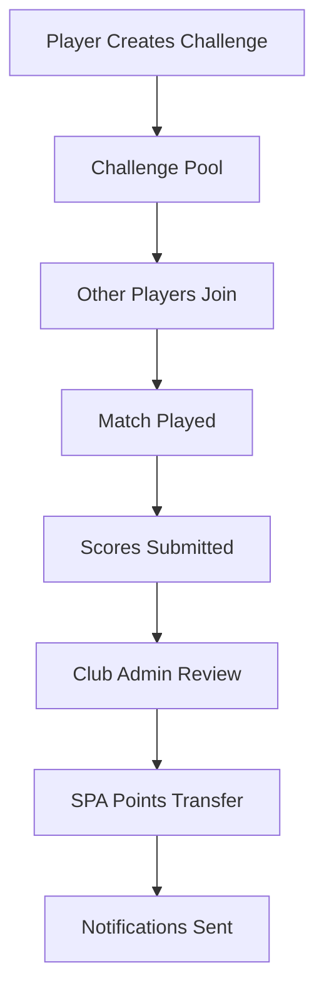
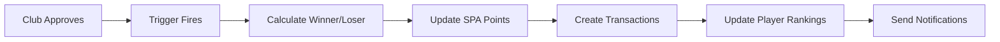

# 🏆 CHALLENGE SYSTEM - COMPLETE DOCUMENTATION
*Hệ thống thách đấu SABO Pool Arena - Tài liệu kỹ thuật đầy đủ*

---

## 📋 **MỤC LỤC**

1. [Tổng quan hệ thống](#tổng-quan-hệ-thống)
2. [Challenge Creation Flow](#challenge-creation-flow)
3. [Challenge Acceptance Flow](#challenge-acceptance-flow)
4. [Match Completion Flow](#match-completion-flow)
5. [Club Approval Flow](#club-approval-flow)
6. [SPA Transfer System](#spa-transfer-system)
7. [Notification System](#notification-system)
8. [Database Architecture](#database-architecture)
9. [Frontend Components](#frontend-components)
10. [Backend Functions](#backend-functions)
11. [Error Handling](#error-handling)
12. [Troubleshooting Guide](#troubleshooting-guide)

---

## 🎯 **TỔNG QUAN HỆ THỐNG**

### **Mục tiêu:**
- Tạo và quản lý thách đấu pool giữa các players
- Xử lý SPA points betting system
- Tích hợp club approval workflow
- Thông báo realtime cho users
- Bảo mật và kiểm tra gian lận

### **Kiến trúc tổng quát:**


---

## 🚀 **1. CHALLENGE CREATION FLOW**

### **Frontend Components:**

#### **`ImprovedCreateChallengeModal.tsx`**
- **Đường dẫn:** `src/components/modals/ImprovedCreateChallengeModal.tsx`
- **Chức năng:** Main UI để tạo challenge
- **Features:**
  - Direct challenge (chọn opponent cụ thể)
  - Open challenge (mở cho tất cả players)
  - SABO handicap system tích hợp
  - Bet points selection (100-650 SPA)
  - Club selection cho location
  - Message system

#### **Key Code Logic:**
```typescript
// Challenge types
const challengeType = 'direct' | 'open';

// Bet configurations với auto race-to
const BET_CONFIGURATIONS = [
  { points: 100, raceTO: 8 },
  { points: 200, raceTO: 9 },
  { points: 300, raceTO: 10 }
  // ...
];

// Handicap calculation
const calculateHandicap = () => {
  return calculateSaboHandicap(
    challengerRank,
    opponentRank, 
    formData.race_to
  );
};
```

### **Backend Processing:**

#### **Database Insert:**
```sql
INSERT INTO challenges (
  challenger_id,
  opponent_id,           -- NULL for open challenges
  bet_points,
  race_to,
  handicap_1_rank,
  handicap_05_rank,
  club_id,
  message,
  status,                -- 'pending'
  expires_at,           -- NOW() + 48 hours
  scheduled_time,
  is_sabo
) VALUES (...);
```

#### **Admin Creation Function:**
```sql
-- For admin-created challenges
SELECT admin_create_challenge(
  p_challenger_id,
  p_opponent_id,
  p_bet_points,
  p_admin_id,
  p_race_to,
  p_message,
  p_club_id,
  p_admin_notes
);
```

### **Notifications Triggered:**

1. **Challenge Created Notification:**
   - **Recipient:** Specific opponent (direct challenge)
   - **Type:** `challenge_received`
   - **Content:** "🎯 Bạn nhận được thách đấu từ [Player Name]"

2. **Open Challenge Notification:**
   - **Recipient:** Club members (if club specified)
   - **Type:** `open_challenge_available`
   - **Content:** "🏆 Challenge mới: [Bet Points] SPA - Race to [X]"

---

## ⚔️ **2. CHALLENGE ACCEPTANCE FLOW**

### **Frontend Handler:**

#### **`EnhancedChallengeCard.tsx`**
```typescript
const handleJoinChallenge = async () => {
  console.log('🎯 [DEBUG] handleJoinChallenge called for challenge:', challenge.id);
  
  try {
    await acceptChallenge(challenge.id);
    toast.success('🎯 Tham gia thách đấu thành công!');
  } catch (error) {
    console.error('🎯 [DEBUG] acceptChallenge error:', error);
    toast.error(error.message);
  }
};
```

### **Backend Function:**

#### **`accept_open_challenge(p_challenge_id, p_user_id)`**
```sql
CREATE OR REPLACE FUNCTION public.accept_open_challenge(
  p_challenge_id UUID,
  p_user_id UUID
)
RETURNS JSONB
LANGUAGE plpgsql
SECURITY DEFINER
AS $$
DECLARE
  v_challenge RECORD;
  v_user_spa INTEGER;
  v_required_spa INTEGER;
  v_match_id UUID;
BEGIN
  -- Validation steps:
  -- 1. Challenge exists and is open
  -- 2. User has sufficient SPA points  
  -- 3. Challenge not expired
  -- 4. User is not the challenger
  
  -- Update challenge
  UPDATE challenges SET 
    opponent_id = p_user_id, 
    status = 'accepted', 
    responded_at = NOW()
  WHERE id = p_challenge_id;
  
  -- Create match record
  INSERT INTO matches (
    player1_id, 
    player2_id, 
    challenge_id, 
    status, 
    match_type
  ) VALUES (
    v_challenge.challenger_id, 
    p_user_id, 
    p_challenge_id, 
    'scheduled', 
    'challenge'
  ) RETURNING id INTO v_match_id;
  
  -- Return success response
  RETURN jsonb_build_object(
    'success', true, 
    'message', 'Successfully joined challenge',
    'match_id', v_match_id
  );
END;
$$;
```

### **Notifications Triggered:**

1. **Challenge Accepted (to Challenger):**
   - **Type:** `challenge_accepted`
   - **Content:** "✅ [Player Name] đã chấp nhận thách đấu của bạn!"

2. **Match Scheduled (to Both):**
   - **Type:** `match_scheduled`
   - **Content:** "📅 Trận đấu đã được lên lịch: [Date/Time]"

---

## 🎮 **3. MATCH COMPLETION FLOW**

### **Score Submission:**

#### **Frontend Components:**
- Challenge card với score input fields
- Real-time validation
- Confirmation dialogs

#### **Database Updates:**
```sql
UPDATE challenges SET
  challenger_score = ?,
  opponent_score = ?,
  status = 'ongoing',
  actual_end_time = NOW()
WHERE id = ?;
```

### **Winner Determination:**
```typescript
const winner = challengerScore > opponentScore 
  ? challenger_id 
  : opponent_id;

const isDraw = challengerScore === opponentScore;
```

### **Notifications Triggered:**

1. **Match Completed (to Both):**
   - **Type:** `match_completed`
   - **Content:** "🏁 Trận đấu hoàn thành! Kết quả: [Score]"

2. **Awaiting Club Approval (to Club Admin):**
   - **Type:** `club_approval_needed`
   - **Content:** "⏳ Cần phê duyệt kết quả: [Challenger] vs [Opponent]"

---

## 🏛️ **4. CLUB APPROVAL FLOW**

### **Frontend Component:**

#### **`ClubApprovalCard.tsx`**
- **Chức năng:** Interface cho club admin phê duyệt
- **Features:**
  - Match summary display
  - SPA transfer preview
  - Approve/Reject buttons
  - Admin notes input

```typescript
const spaTransfer = useSPAPointCalculation({
  challengerId: challenge.challenger_id,
  challengerScore: challenge.challenger_score,
  opponentId: challenge.opponent_id, 
  opponentScore: challenge.opponent_score,
  betPoints: challenge.bet_points
});

const handleApproval = async (approve: boolean) => {
  await clubApproval.mutateAsync({
    challengeId: challenge.id,
    approve,
    adminNote: adminNote
  });
};
```

### **Backend Processing:**

#### **Club Approval Update:**
```sql
UPDATE challenges SET
  club_confirmed = true,
  club_confirmed_at = NOW(),
  club_note = 'Admin approval note',
  status = 'completed',
  completed_at = NOW()
WHERE id = challenge_id;
```

#### **Trigger Activation:**
```sql
-- Trigger automatically fires on club_confirmed = true
CREATE TRIGGER club_confirmation_trigger
  AFTER UPDATE ON challenges
  FOR EACH ROW
  EXECUTE FUNCTION process_club_confirmation();
```

### **Notifications Triggered:**

1. **Approval Confirmed (to Players):**
   - **Type:** `club_approved`
   - **Winner:** "🎉 CLB đã xác nhận - Bạn thắng và nhận [X] SPA!"
   - **Loser:** "📊 CLB đã xác nhận kết quả - Mất [X] SPA"

2. **Rejection Notice (to Players):**
   - **Type:** `club_rejected`
   - **Content:** "❌ CLB không chấp nhận kết quả. Lý do: [Admin Note]"

---

## 💰 **5. SPA TRANSFER SYSTEM**

### **Architecture Overview:**


### **Core Functions:**

#### **SPA Transfer Trigger:**
```sql
CREATE OR REPLACE FUNCTION process_spa_on_completion()
RETURNS TRIGGER
SECURITY DEFINER
LANGUAGE plpgsql AS $$
DECLARE
    winner_id UUID;
    loser_id UUID;
    points_amount INTEGER;
BEGIN
    -- Only process when status = 'completed' AND club_confirmed = true
    IF NEW.status = 'completed' AND NEW.club_confirmed = true THEN
        
        points_amount := COALESCE(NEW.bet_points, 0);
        
        -- Determine winner based on scores
        IF NEW.challenger_score > NEW.opponent_score THEN
            winner_id := NEW.challenger_id;
            loser_id := NEW.opponent_id;
        ELSIF NEW.opponent_score > NEW.challenger_score THEN
            winner_id := NEW.opponent_id;
            loser_id := NEW.challenger_id;
        ELSE
            -- Draw - no transfer
            RETURN NEW;
        END IF;
        
        -- Transfer SPA points
        IF points_amount > 0 THEN
            -- Add to winner
            UPDATE player_rankings SET 
                spa_points = spa_points + points_amount,
                updated_at = NOW()
            WHERE user_id = winner_id;
            
            -- Subtract from loser  
            UPDATE player_rankings SET
                spa_points = GREATEST(0, spa_points - points_amount),
                updated_at = NOW()
            WHERE user_id = loser_id;
            
            -- Create transaction records
            INSERT INTO spa_transactions (
                user_id, points, transaction_type, 
                description, reference_id, reference_type
            ) VALUES 
                (winner_id, points_amount, 'challenge_win', 
                 'Won challenge match', NEW.id, 'challenge'),
                (loser_id, -points_amount, 'challenge_loss',
                 'Lost challenge match', NEW.id, 'challenge');
        END IF;
    END IF;
    
    RETURN NEW;
END;
$$;
```

#### **Manual SPA Functions:**
```sql
-- Add SPA points (for winners)
SELECT update_spa_points(
  p_user_id := winner_id,
  p_points := bet_points,
  p_source_type := 'challenge_win',
  p_description := 'Challenge victory',
  p_reference_id := challenge_id
);

-- Subtract SPA points (for losers)
SELECT subtract_spa_points(
  p_user_id := loser_id,
  p_points_to_subtract := bet_points
);
```

### **Frontend SPA Processing:**

#### **`CleanChallengesTab.tsx` - processSpaTransfer:**
```typescript
const processSpaTransfer = async (challenge) => {
  const winner_id = challenge.challenger_score > challenge.opponent_score 
    ? challenge.challenger_id 
    : challenge.opponent_id;
    
  const loser_id = challenge.challenger_score > challenge.opponent_score 
    ? challenge.opponent_id 
    : challenge.challenger_id;
    
  // Add SPA to winner
  const { data: winnerResult, error: winnerError } = await supabase
    .rpc('update_spa_points', {
      p_user_id: winner_id,
      p_points: challenge.bet_points,
      p_source_type: 'challenge_win',
      p_description: `Won challenge against opponent`,
      p_reference_id: challenge.id
    });
    
  // Subtract SPA from loser
  const { data: loserResult, error: loserError } = await supabase
    .rpc('subtract_spa_points', {
      p_user_id: loser_id,
      p_points_to_subtract: challenge.bet_points
    });
};
```

### **Notifications Triggered:**

1. **SPA Transfer Success (Winner):**
   - **Type:** `spa_received`
   - **Content:** "💰 +[X] SPA - Thắng thách đấu vs [Opponent]"

2. **SPA Transfer Notice (Loser):**
   - **Type:** `spa_deducted`  
   - **Content:** "📉 -[X] SPA - Thua thách đấu vs [Winner]"

---

## 🔔 **6. NOTIFICATION SYSTEM**

### **Architecture:**

#### **Database Schema:**
```sql
-- Main notifications table
CREATE TABLE challenge_notifications (
    id UUID PRIMARY KEY DEFAULT gen_random_uuid(),
    user_id UUID REFERENCES auth.users(id),
    type VARCHAR(50) NOT NULL,
    title VARCHAR(200) NOT NULL,
    message TEXT NOT NULL,
    challenge_id UUID REFERENCES challenges(id),
    icon VARCHAR(50),
    priority VARCHAR(20) DEFAULT 'medium',
    is_read BOOLEAN DEFAULT false,
    action_url TEXT,
    action_label VARCHAR(100),
    created_at TIMESTAMPTZ DEFAULT NOW()
);

-- Real-time subscriptions table  
CREATE TABLE notification_subscriptions (
    id UUID PRIMARY KEY DEFAULT gen_random_uuid(),
    user_id UUID REFERENCES auth.users(id),
    endpoint TEXT NOT NULL,
    p256dh TEXT NOT NULL,
    auth TEXT NOT NULL,
    created_at TIMESTAMPTZ DEFAULT NOW()
);
```

#### **Notification Types:**
```typescript
type NotificationType = 
  | 'challenge_received'      // Direct challenge invitation
  | 'challenge_accepted'      // Challenge was accepted
  | 'challenge_declined'      // Challenge was declined
  | 'match_scheduled'         // Match time confirmed
  | 'match_completed'         // Match finished, awaiting approval
  | 'club_approval_needed'    // Admin needs to review
  | 'club_approved'          // Club confirmed result
  | 'club_rejected'          // Club rejected result
  | 'spa_received'           // SPA points gained
  | 'spa_deducted'           // SPA points lost
  | 'challenge_expired'      // Challenge timed out
  | 'rank_updated'           // Player rank changed
  | 'achievement_unlocked';  // New achievement earned
```

### **Frontend Components:**

#### **`NotificationCenter.tsx`** (hypothetical)
```typescript
const useNotifications = () => {
  const [notifications, setNotifications] = useState([]);
  
  useEffect(() => {
    // Subscribe to real-time notifications
    const subscription = supabase
      .channel('challenge_notifications')
      .on('postgres_changes', {
        event: 'INSERT',
        schema: 'public',
        table: 'challenge_notifications',
        filter: `user_id=eq.${user.id}`
      }, (payload) => {
        const newNotification = payload.new;
        
        // Add to state
        setNotifications(prev => [newNotification, ...prev]);
        
        // Show toast
        toast(newNotification.title, {
          description: newNotification.message,
          icon: getNotificationIcon(newNotification.icon),
          action: newNotification.action_url ? {
            label: newNotification.action_label,
            onClick: () => navigate(newNotification.action_url)
          } : undefined
        });
      })
      .subscribe();
      
    return () => subscription.unsubscribe();
  }, [user.id]);
};
```

### **Backend Notification Functions:**

#### **`create_challenge_notification`:**
```sql
CREATE OR REPLACE FUNCTION create_challenge_notification(
  p_type VARCHAR(50),
  p_user_id UUID,
  p_title VARCHAR(200),
  p_message TEXT,
  p_challenge_id UUID DEFAULT NULL,
  p_icon VARCHAR(50) DEFAULT 'bell',
  p_priority VARCHAR(20) DEFAULT 'medium',
  p_action_label VARCHAR(100) DEFAULT NULL,
  p_action_url TEXT DEFAULT NULL
)
RETURNS UUID
LANGUAGE plpgsql
SECURITY DEFINER
AS $$
DECLARE
  v_notification_id UUID;
BEGIN
  INSERT INTO challenge_notifications (
    type, user_id, title, message, challenge_id,
    icon, priority, action_label, action_url
  ) VALUES (
    p_type, p_user_id, p_title, p_message, p_challenge_id,
    p_icon, p_priority, p_action_label, p_action_url
  ) RETURNING id INTO v_notification_id;
  
  RETURN v_notification_id;
END;
$$;
```

#### **Event-Driven Notifications:**
```sql
-- Example: Challenge creation notification
CREATE OR REPLACE FUNCTION notify_challenge_created()
RETURNS TRIGGER AS $$
BEGIN
  -- Notify specific opponent for direct challenges
  IF NEW.opponent_id IS NOT NULL THEN
    PERFORM create_challenge_notification(
      'challenge_received',
      NEW.opponent_id,
      '🎯 Thách đấu mới!',
      format('Bạn nhận được thách đấu từ %s - %s SPA points', 
             challenger_name, NEW.bet_points),
      NEW.id,
      'target',
      'high',
      'Xem chi tiết',
      '/challenges/' || NEW.id
    );
  END IF;
  
  RETURN NEW;
END;
$$ LANGUAGE plpgsql;

CREATE TRIGGER challenge_created_notification
  AFTER INSERT ON challenges
  FOR EACH ROW
  EXECUTE FUNCTION notify_challenge_created();
```

---

## 🗄️ **7. DATABASE ARCHITECTURE**

### **Core Tables:**

#### **`challenges` - Main Challenge Data**
```sql
CREATE TABLE challenges (
    id UUID PRIMARY KEY DEFAULT gen_random_uuid(),
    challenger_id UUID REFERENCES auth.users(id) NOT NULL,
    opponent_id UUID REFERENCES auth.users(id),
    club_id UUID REFERENCES club_profiles(id),
    
    -- Game settings
    bet_points INTEGER NOT NULL CHECK (bet_points BETWEEN 100 AND 650),
    race_to INTEGER NOT NULL DEFAULT 8,
    handicap_1_rank DECIMAL(3,1) DEFAULT 0,
    handicap_05_rank DECIMAL(3,1) DEFAULT 0,
    
    -- Status tracking
    status VARCHAR(20) DEFAULT 'pending' CHECK (
        status IN ('pending', 'accepted', 'declined', 'ongoing', 
                  'completed', 'cancelled', 'expired')
    ),
    
    -- Timing
    created_at TIMESTAMPTZ DEFAULT NOW(),
    expires_at TIMESTAMPTZ DEFAULT (NOW() + INTERVAL '48 hours'),
    scheduled_time TIMESTAMPTZ,
    responded_at TIMESTAMPTZ,
    actual_start_time TIMESTAMPTZ,
    actual_end_time TIMESTAMPTZ,
    
    -- Match results
    challenger_score INTEGER,
    opponent_score INTEGER,
    winner_id UUID REFERENCES auth.users(id),
    
    -- Club approval
    club_confirmed BOOLEAN DEFAULT FALSE,
    club_confirmed_at TIMESTAMPTZ,
    club_note TEXT,
    
    -- Metadata
    message TEXT,
    location TEXT,
    is_sabo BOOLEAN DEFAULT TRUE,
    admin_created_by UUID REFERENCES profiles(user_id),
    admin_notes TEXT,
    
    -- Timestamps
    completed_at TIMESTAMPTZ,
    updated_at TIMESTAMPTZ DEFAULT NOW()
);
```

#### **`matches` - Match Tracking**
```sql
CREATE TABLE matches (
    id UUID PRIMARY KEY DEFAULT gen_random_uuid(),
    player1_id UUID REFERENCES auth.users(id) NOT NULL,
    player2_id UUID REFERENCES auth.users(id) NOT NULL,
    challenge_id UUID REFERENCES challenges(id),
    
    status VARCHAR(20) DEFAULT 'scheduled' CHECK (
        status IN ('scheduled', 'ongoing', 'completed', 'cancelled')
    ),
    
    match_type VARCHAR(50) DEFAULT 'challenge',
    scheduled_time TIMESTAMPTZ,
    started_at TIMESTAMPTZ,
    completed_at TIMESTAMPTZ,
    
    -- Results tracking
    player1_score INTEGER DEFAULT 0,
    player2_score INTEGER DEFAULT 0,
    winner_id UUID REFERENCES auth.users(id),
    
    created_at TIMESTAMPTZ DEFAULT NOW(),
    updated_at TIMESTAMPTZ DEFAULT NOW()
);
```

#### **`player_rankings` - SPA Points & Rankings**
```sql
CREATE TABLE player_rankings (
    id UUID PRIMARY KEY DEFAULT gen_random_uuid(),
    user_id UUID REFERENCES auth.users(id) UNIQUE NOT NULL,
    player_id UUID REFERENCES auth.users(id), -- Alias for user_id
    
    -- SPA System
    spa_points INTEGER DEFAULT 0 CHECK (spa_points >= 0),
    
    -- Rankings
    current_rank VARCHAR(10),
    elo_points INTEGER DEFAULT 1200,
    
    -- Statistics
    games_played INTEGER DEFAULT 0,
    games_won INTEGER DEFAULT 0,
    games_lost INTEGER DEFAULT 0,
    win_percentage DECIMAL(5,2) DEFAULT 0.00,
    
    -- Streaks
    current_streak INTEGER DEFAULT 0,
    longest_streak INTEGER DEFAULT 0,
    
    created_at TIMESTAMPTZ DEFAULT NOW(),
    updated_at TIMESTAMPTZ DEFAULT NOW()
);
```

#### **`spa_transactions` - SPA Movement Tracking**
```sql
CREATE TABLE spa_transactions (
    id UUID PRIMARY KEY DEFAULT gen_random_uuid(),
    user_id UUID REFERENCES auth.users(id) NOT NULL,
    
    points INTEGER NOT NULL, -- Can be negative for deductions
    transaction_type VARCHAR(50) NOT NULL,
    description TEXT,
    
    -- Reference tracking
    reference_id UUID,
    reference_type VARCHAR(50),
    
    -- Metadata
    metadata JSONB,
    created_at TIMESTAMPTZ DEFAULT NOW()
);
```

### **Indexes & Performance:**
```sql
-- Critical performance indexes
CREATE INDEX idx_challenges_status ON challenges(status);
CREATE INDEX idx_challenges_challenger ON challenges(challenger_id);
CREATE INDEX idx_challenges_opponent ON challenges(opponent_id);
CREATE INDEX idx_challenges_club ON challenges(club_id);
CREATE INDEX idx_challenges_expires ON challenges(expires_at);

CREATE INDEX idx_player_rankings_user ON player_rankings(user_id);
CREATE INDEX idx_player_rankings_spa ON player_rankings(spa_points DESC);

CREATE INDEX idx_spa_transactions_user ON spa_transactions(user_id);
CREATE INDEX idx_spa_transactions_type ON spa_transactions(transaction_type);
CREATE INDEX idx_spa_transactions_created ON spa_transactions(created_at DESC);
```

### **Row Level Security (RLS):**
```sql
-- Enable RLS on all tables
ALTER TABLE challenges ENABLE ROW LEVEL SECURITY;
ALTER TABLE matches ENABLE ROW LEVEL SECURITY;
ALTER TABLE player_rankings ENABLE ROW LEVEL SECURITY;
ALTER TABLE spa_transactions ENABLE ROW LEVEL SECURITY;

-- Challenges policy - users can see challenges they're involved in
CREATE POLICY challenges_select_policy ON challenges
  FOR SELECT USING (
    challenger_id = auth.uid() OR 
    opponent_id = auth.uid() OR
    (opponent_id IS NULL AND status = 'pending') -- Open challenges visible to all
  );

-- Matches policy - participants can see their matches
CREATE POLICY matches_select_policy ON matches
  FOR SELECT USING (
    player1_id = auth.uid() OR player2_id = auth.uid()
  );

-- Player rankings - public read, own record update
CREATE POLICY rankings_select_policy ON player_rankings
  FOR SELECT USING (true);

CREATE POLICY rankings_update_policy ON player_rankings
  FOR UPDATE USING (user_id = auth.uid());

-- SPA transactions - users can only see their own
CREATE POLICY spa_transactions_select_policy ON spa_transactions
  FOR SELECT USING (user_id = auth.uid());
```

---

## 🎨 **8. FRONTEND COMPONENTS**

### **Challenge Management Components:**

#### **1. `ImprovedCreateChallengeModal.tsx`**
- **Đường dẫn:** `src/components/modals/ImprovedCreateChallengeModal.tsx`
- **Chức năng:** Main challenge creation interface
- **Props:**
  ```typescript
  interface Props {
    isOpen: boolean;
    onClose: () => void;
    onSuccess?: (challenge: Challenge) => void;
  }
  ```

#### **2. `EnhancedChallengeCard.tsx`**
- **Đường dẫn:** `src/components/challenges/EnhancedChallengeCard.tsx`
- **Chức năng:** Display individual challenge with actions
- **Props:**
  ```typescript
  interface Props {
    challenge: Challenge;
    currentUserId?: string;
    onAction?: (action: string, challengeId: string) => void;
  }
  ```

#### **3. `ClubApprovalCard.tsx`**
- **Đường dẫn:** `src/components/challenges/ClubApprovalCard.tsx`
- **Chức năng:** Club admin approval interface
- **Features:**
  - Match result summary
  - SPA transfer preview
  - Approval/rejection actions
  - Admin notes input

### **Hook Components:**

#### **1. `useEnhancedChallengesV3.tsx`**
- **Đường dẫn:** `src/hooks/useEnhancedChallengesV3.tsx`
- **Chức năng:** Main challenge management hook
- **Methods:**
  ```typescript
  const {
    challenges,
    loading,
    error,
    createChallenge,
    acceptChallenge,
    declineChallenge,
    autoExpireChallenges
  } = useEnhancedChallengesV3();
  ```

#### **2. `useChallengeWorkflow.tsx`**
- **Đường dẫn:** `src/hooks/useChallengeWorkflow.tsx`
- **Chức năng:** Match workflow management
- **Methods:**
  ```typescript
  const {
    getChallengeMatch,
    startMatch,
    submitScore,
    confirmResult,
    sendMessage,
    scheduleChallenge
  } = useChallengeWorkflow();
  ```

#### **3. `useScoreSubmission.ts`**
- **Đường dẫn:** `src/hooks/useScoreSubmission.ts`
- **Chức năng:** Score submission and club approval
- **Methods:**
  ```typescript
  const clubApproval = useClubApproval();
  const scoreSubmission = useScoreSubmission();
  ```

### **Utility Components:**

#### **1. SPA Calculation Hooks:**
```typescript
// SPA point calculation
const useSPAPointCalculation = (params) => {
  return {
    winnerSpa: calculateWinnerSpa(params),
    loserSpa: calculateLoserSpa(params),
    hasTransfer: params.betPoints > 0
  };
};

// SPA change display
const useSPAChangeDisplay = (spaTransfer) => {
  return {
    winnerDisplay: `+${spaTransfer.winnerSpa} SPA`,
    loserDisplay: `-${spaTransfer.loserSpa} SPA`,
    hasTransfer: spaTransfer.hasTransfer
  };
};
```

#### **2. Real-time Subscriptions:**
```typescript
// Challenge updates subscription
useEffect(() => {
  const subscription = supabase
    .channel('challenges')
    .on('postgres_changes', {
      event: '*',
      schema: 'public',
      table: 'challenges'
    }, (payload) => {
      handleChallengeUpdate(payload);
    })
    .subscribe();
    
  return () => subscription.unsubscribe();
}, []);
```

---

## ⚙️ **9. BACKEND FUNCTIONS**

### **Challenge Management Functions:**

#### **1. `accept_open_challenge`**
```sql
CREATE OR REPLACE FUNCTION public.accept_open_challenge(
  p_challenge_id UUID,
  p_user_id UUID
)
RETURNS JSONB
```
- **Chức năng:** Accept open challenge with full validation
- **Validations:** SPA balance, challenge availability, user eligibility
- **Returns:** Success/error JSON object

#### **2. `admin_create_challenge`**
```sql
CREATE OR REPLACE FUNCTION public.admin_create_challenge(
  p_challenger_id UUID,
  p_opponent_id UUID,
  p_bet_points INTEGER,
  p_admin_id UUID,
  -- ... more parameters
)
RETURNS JSONB
```
- **Chức năng:** Admin-created challenges with special privileges
- **Features:** Bypass normal limitations, auto-accept option

#### **3. `create_challenge_safe`**
```sql
CREATE OR REPLACE FUNCTION create_challenge_safe(
  p_opponent_id UUID DEFAULT NULL,
  p_bet_points INTEGER DEFAULT 100,
  -- ... parameters
)
RETURNS JSONB
```
- **Chức năng:** Safe challenge creation with comprehensive validation

### **SPA Management Functions:**

#### **1. `update_spa_points`**
```sql
CREATE OR REPLACE FUNCTION public.update_spa_points(
  p_user_id UUID,
  p_points INTEGER,
  p_source_type VARCHAR(50) DEFAULT 'system',
  p_description TEXT DEFAULT NULL,
  p_reference_id UUID DEFAULT NULL
)
RETURNS JSONB
```
- **Chức năng:** Add SPA points to user account
- **Features:** Transaction logging, balance validation

#### **2. `subtract_spa_points`**
```sql
CREATE OR REPLACE FUNCTION public.subtract_spa_points(
  p_user_id UUID,
  p_points_to_subtract INTEGER
)
RETURNS JSONB
```
- **Chức năng:** Deduct SPA points from user account
- **Safety:** Prevents negative balances

#### **3. `complete_challenge_match`**
```sql
CREATE OR REPLACE FUNCTION public.complete_challenge_match(
  p_match_id UUID,
  p_winner_id UUID,
  p_loser_id UUID,
  p_wager_points INTEGER
)
RETURNS JSONB
```
- **Chức năng:** Complete match and process SPA transfer

### **Notification Functions:**

#### **1. `create_challenge_notification`**
```sql
CREATE OR REPLACE FUNCTION create_challenge_notification(
  p_type VARCHAR(50),
  p_user_id UUID,
  p_title VARCHAR(200),
  p_message TEXT,
  p_challenge_id UUID DEFAULT NULL
  -- ... more parameters  
)
RETURNS UUID
```
- **Chức năng:** Create notification with real-time broadcast

#### **2. Event-Driven Notification Triggers:**
- `notify_challenge_created()` - New challenge notifications
- `notify_challenge_accepted()` - Acceptance notifications
- `notify_club_approval()` - Club decision notifications
- `notify_spa_transfer()` - SPA transaction notifications

### **Trigger Functions:**

#### **1. `process_club_confirmation()`**
```sql
CREATE OR REPLACE FUNCTION public.process_club_confirmation()
RETURNS TRIGGER
```
- **Activation:** When `club_confirmed` changes to `true`
- **Action:** Initiate SPA transfer process

#### **2. `process_spa_on_completion()`**
```sql
CREATE OR REPLACE FUNCTION process_spa_on_completion()
RETURNS TRIGGER
SECURITY DEFINER
```
- **Activation:** When challenge status becomes `completed`
- **Action:** Automatic SPA point transfer

#### **3. `update_challenge_status()`**
```sql
CREATE OR REPLACE FUNCTION update_challenge_status()
RETURNS TRIGGER
```
- **Activation:** Before UPDATE on challenges
- **Action:** Auto-update status based on conditions

---

## 🚨 **10. ERROR HANDLING**

### **Frontend Error Handling:**

#### **Challenge Creation Errors:**
```typescript
try {
  await createChallenge(challengeData);
  toast.success('Challenge created successfully!');
} catch (error) {
  if (error.message.includes('insufficient SPA')) {
    toast.error('Không đủ SPA points để tạo thách đấu');
  } else if (error.message.includes('daily limit')) {
    toast.error('Đã đạt giới hạn tạo thách đấu trong ngày');
  } else {
    toast.error(`Lỗi tạo thách đấu: ${error.message}`);
  }
}
```

#### **Challenge Acceptance Errors:**
```typescript
const handleAcceptanceError = (error) => {
  const errorHandlers = {
    'Challenge not found': 'Thách đấu không tồn tại',
    'Challenge is not open': 'Thách đấu đã có người chấp nhận',
    'Insufficient SPA points': 'Không đủ SPA points',
    'Challenge has expired': 'Thách đấu đã hết hạn',
    'Cannot accept your own challenge': 'Không thể tự thách đấu bản thân'
  };
  
  const message = errorHandlers[error.message] || error.message;
  toast.error(message);
};
```

### **Backend Error Handling:**

#### **Function Error Patterns:**
```sql
-- Standardized error response format
DECLARE
  v_error_code VARCHAR(50);
  v_error_message TEXT;
BEGIN
  -- Business logic
  
EXCEPTION 
  WHEN insufficient_privilege THEN
    RETURN jsonb_build_object(
      'success', false,
      'error_code', 'INSUFFICIENT_PRIVILEGE',
      'error', 'You do not have permission to perform this action'
    );
    
  WHEN check_violation THEN
    RETURN jsonb_build_object(
      'success', false,
      'error_code', 'VALIDATION_ERROR',
      'error', 'Data validation failed: ' || SQLERRM
    );
    
  WHEN OTHERS THEN
    RETURN jsonb_build_object(
      'success', false,
      'error_code', 'INTERNAL_ERROR',
      'error', 'Internal server error: ' || SQLERRM
    );
END;
```

#### **Common Error Scenarios:**

1. **SPA Insufficient Balance:**
   ```sql
   IF v_user_spa < v_required_spa THEN
     RETURN jsonb_build_object(
       'success', false,
       'error', format('Insufficient SPA points. Required: %s, Available: %s', 
                      v_required_spa, v_user_spa),
       'required_spa', v_required_spa,
       'user_spa', v_user_spa,
       'shortage', v_required_spa - v_user_spa
     );
   END IF;
   ```

2. **Challenge Validation Errors:**
   ```sql
   -- Challenge not found
   IF NOT FOUND THEN
     RETURN jsonb_build_object('success', false, 'error', 'Challenge not found');
   END IF;
   
   -- Challenge already taken
   IF v_challenge.opponent_id IS NOT NULL THEN
     RETURN jsonb_build_object('success', false, 'error', 'Challenge is not open');
   END IF;
   
   -- Challenge expired
   IF v_challenge.expires_at < NOW() THEN
     RETURN jsonb_build_object('success', false, 'error', 'Challenge has expired');
   END IF;
   ```

3. **Concurrency Control:**
   ```sql
   -- Row-level locking to prevent race conditions
   SELECT * INTO v_challenge
   FROM challenges 
   WHERE id = p_challenge_id
   FOR UPDATE NOWAIT;
   
   -- Handle lock timeout
   EXCEPTION WHEN lock_not_available THEN
     RETURN jsonb_build_object(
       'success', false,
       'error', 'Challenge is currently being processed by another user'
     );
   ```

### **Logging & Monitoring:**

#### **Application Logging:**
```typescript
// Structured logging for debugging
const logChallengeAction = (action: string, challengeId: string, details: any) => {
  console.log(`🎯 [CHALLENGE_${action.toUpperCase()}]`, {
    challengeId,
    userId: user?.id,
    timestamp: new Date().toISOString(),
    ...details
  });
};

// Usage
logChallengeAction('ACCEPT', challengeId, {
  userSpa: currentUserProfile?.spa_points,
  requiredSpa: challenge.bet_points,
  challengeStatus: challenge.status
});
```

#### **Database Logging:**
```sql
-- Error logging table
CREATE TABLE error_logs (
    id UUID PRIMARY KEY DEFAULT gen_random_uuid(),
    function_name VARCHAR(100),
    error_code VARCHAR(50),
    error_message TEXT,
    user_id UUID,
    context JSONB,
    created_at TIMESTAMPTZ DEFAULT NOW()
);

-- Logging function
CREATE OR REPLACE FUNCTION log_error(
  p_function_name VARCHAR(100),
  p_error_code VARCHAR(50),
  p_error_message TEXT,
  p_user_id UUID DEFAULT NULL,
  p_context JSONB DEFAULT NULL
)
RETURNS VOID AS $$
BEGIN
  INSERT INTO error_logs (function_name, error_code, error_message, user_id, context)
  VALUES (p_function_name, p_error_code, p_error_message, p_user_id, p_context);
END;
$$ LANGUAGE plpgsql SECURITY DEFINER;
```

---

## 🔧 **11. TROUBLESHOOTING GUIDE**

### **Common Issues & Solutions:**

#### **Issue 1: "record 'new' has no field 'challenger_rank'"**
```sql
-- Problem: Trigger trying to access non-existent field
-- Solution: Find and fix the trigger
SELECT 
  trigger_name,
  event_manipulation,
  event_object_table,
  action_statement
FROM information_schema.triggers 
WHERE action_statement LIKE '%challenger_rank%';

-- Fix the trigger by removing invalid field references
```

#### **Issue 2: Challenge Acceptance Fails Silently**
```typescript
// Debug acceptance flow
console.log('🔍 Pre-validation challenge data:', {
  id: challenge.id,
  status: challenge.status,
  opponent_id: challenge.opponent_id,
  challenger_id: challenge.challenger_id,
  expires_at: challenge.expires_at
});

console.log('🔍 SPA Validation Debug:', {
  currentUserProfile,
  userSpa: currentUserProfile?.spa_points,
  requiredSpa: challenge.bet_points,
  userId: user?.id
});
```

#### **Issue 3: SPA Points Not Transferring**
```sql
-- Check if trigger exists and is active
SELECT 
  trigger_name,
  event_object_table,
  trigger_schema,
  action_statement
FROM information_schema.triggers 
WHERE event_object_table = 'challenges'
  AND action_statement LIKE '%spa%';

-- Verify SPA transfer functions exist
SELECT routine_name 
FROM information_schema.routines 
WHERE routine_name IN ('update_spa_points', 'subtract_spa_points');

-- Check recent SPA transactions
SELECT * FROM spa_transactions 
WHERE created_at > NOW() - INTERVAL '1 day'
ORDER BY created_at DESC;
```

#### **Issue 4: Real-time Updates Not Working**
```typescript
// Verify subscription setup
const testSubscription = () => {
  const channel = supabase.channel('test-channel');
  
  channel
    .on('postgres_changes', {
      event: 'UPDATE',
      schema: 'public',
      table: 'challenges'
    }, (payload) => {
      console.log('📡 Real-time update received:', payload);
    })
    .subscribe((status) => {
      console.log('📡 Subscription status:', status);
    });
};
```

#### **Issue 5: Club Approval Not Processing**
```sql
-- Check club approval workflow
SELECT 
  id,
  status,
  club_confirmed,
  club_confirmed_at,
  challenger_score,
  opponent_score,
  bet_points
FROM challenges 
WHERE club_confirmed = true
  AND status = 'completed'
  AND created_at > NOW() - INTERVAL '7 days';

-- Verify club approval trigger
SELECT * FROM pg_trigger 
WHERE tgname = 'club_confirmation_trigger';
```

### **Debug Scripts:**

#### **1. Challenge Flow Debug:**
```sql
-- Complete challenge flow analysis
WITH challenge_analysis AS (
  SELECT 
    id,
    status,
    created_at,
    expires_at,
    challenger_id,
    opponent_id,
    challenger_score,
    opponent_score,
    club_confirmed,
    bet_points,
    CASE 
      WHEN expires_at < NOW() THEN 'EXPIRED'
      WHEN opponent_id IS NULL THEN 'OPEN'
      WHEN challenger_score IS NULL THEN 'ACCEPTED_PENDING'
      WHEN club_confirmed IS NULL THEN 'AWAITING_APPROVAL'
      WHEN club_confirmed = true THEN 'COMPLETED'
      ELSE 'OTHER'
    END as flow_stage
  FROM challenges
  WHERE created_at > NOW() - INTERVAL '7 days'
)
SELECT 
  flow_stage,
  COUNT(*) as count,
  AVG(EXTRACT(EPOCH FROM (NOW() - created_at))/3600) as avg_hours_old
FROM challenge_analysis
GROUP BY flow_stage
ORDER BY count DESC;
```

#### **2. SPA Balance Debug:**
```sql
-- User SPA balance verification
SELECT 
  pr.user_id,
  p.full_name,
  pr.spa_points as current_spa,
  COALESCE(st_summary.total_transactions, 0) as total_transactions,
  COALESCE(st_summary.net_change, 0) as net_spa_change
FROM player_rankings pr
LEFT JOIN profiles p ON pr.user_id = p.user_id
LEFT JOIN (
  SELECT 
    user_id,
    COUNT(*) as total_transactions,
    SUM(points) as net_change
  FROM spa_transactions
  WHERE created_at > NOW() - INTERVAL '30 days'
  GROUP BY user_id
) st_summary ON pr.user_id = st_summary.user_id
WHERE pr.user_id = 'YOUR_USER_ID';
```

#### **3. Notification Debug:**
```sql
-- Recent notification analysis
SELECT 
  type,
  COUNT(*) as count,
  MAX(created_at) as latest,
  AVG(CASE WHEN is_read THEN 1 ELSE 0 END) as read_rate
FROM challenge_notifications 
WHERE created_at > NOW() - INTERVAL '24 hours'
GROUP BY type
ORDER BY count DESC;
```

### **Performance Optimization:**

#### **1. Database Indexes:**
```sql
-- Add missing indexes for common queries
CREATE INDEX CONCURRENTLY idx_challenges_status_created 
ON challenges(status, created_at DESC);

CREATE INDEX CONCURRENTLY idx_challenges_club_status 
ON challenges(club_id, status) 
WHERE club_id IS NOT NULL;

CREATE INDEX CONCURRENTLY idx_spa_transactions_user_created 
ON spa_transactions(user_id, created_at DESC);
```

#### **2. Query Optimization:**
```sql
-- Efficient open challenges query
SELECT c.*, p.full_name as challenger_name
FROM challenges c
JOIN profiles p ON c.challenger_id = p.user_id
WHERE c.status = 'pending'
  AND c.opponent_id IS NULL
  AND c.expires_at > NOW()
ORDER BY c.created_at DESC
LIMIT 20;
```

#### **3. Frontend Performance:**
```typescript
// Optimize challenge list with pagination
const usePaginatedChallenges = (pageSize = 20) => {
  const [page, setPage] = useState(0);
  
  const { data, isLoading } = useQuery({
    queryKey: ['challenges', page],
    queryFn: () => fetchChallenges(page * pageSize, pageSize),
    keepPreviousData: true
  });
  
  return {
    challenges: data?.challenges || [],
    hasMore: data?.hasMore || false,
    loadMore: () => setPage(p => p + 1),
    isLoading
  };
};
```

---

## 📝 **12. DEPLOYMENT & MAINTENANCE**

### **Migration Strategy:**

#### **1. Database Migrations:**
```sql
-- Migration template
-- File: supabase/migrations/YYYYMMDD_HHMMSS_feature_name.sql

-- Enable necessary extensions
CREATE EXTENSION IF NOT EXISTS "uuid-ossp";

-- Create/modify tables
CREATE TABLE IF NOT EXISTS new_feature_table (...);

-- Create functions
CREATE OR REPLACE FUNCTION new_feature_function(...) 
RETURNS ... AS $$ ... $$;

-- Create triggers  
CREATE TRIGGER trigger_name ...;

-- Update RLS policies
CREATE POLICY policy_name ON table_name ...;

-- Grant permissions
GRANT SELECT, INSERT, UPDATE ON table_name TO authenticated;
GRANT EXECUTE ON FUNCTION function_name TO authenticated;
```

#### **2. Frontend Deployment:**
```bash
# Build process
npm run build

# Environment variables check
npm run env:check

# Database schema validation
npm run db:validate

# Deploy to production
npm run deploy
```

### **Monitoring & Maintenance:**

#### **1. Health Checks:**
```sql
-- System health query
SELECT 
  'challenges' as table_name,
  COUNT(*) as total_records,
  COUNT(*) FILTER (WHERE created_at > NOW() - INTERVAL '24 hours') as recent_records,
  COUNT(*) FILTER (WHERE status = 'pending') as pending_challenges
FROM challenges

UNION ALL

SELECT 
  'spa_transactions' as table_name,
  COUNT(*) as total_records,
  COUNT(*) FILTER (WHERE created_at > NOW() - INTERVAL '24 hours') as recent_records,
  COALESCE(SUM(points) FILTER (WHERE created_at > NOW() - INTERVAL '24 hours'), 0) as daily_spa_volume
FROM spa_transactions;
```

#### **2. Performance Monitoring:**
```sql
-- Slow query identification
SELECT 
  query,
  calls,
  total_time,
  mean_time,
  rows
FROM pg_stat_statements 
WHERE query LIKE '%challenges%'
ORDER BY mean_time DESC
LIMIT 10;
```

#### **3. Error Monitoring:**
```typescript
// Frontend error tracking
const errorBoundary = (error: Error, errorInfo: any) => {
  // Send to monitoring service
  analytics.track('Frontend Error', {
    error: error.message,
    stack: error.stack,
    componentStack: errorInfo.componentStack,
    userId: user?.id,
    timestamp: new Date().toISOString()
  });
};
```

### **Backup & Recovery:**

#### **1. Database Backup:**
```bash
# Automated backup script
#!/bin/bash
DATE=$(date +%Y%m%d_%H%M%S)
DB_URL="your_database_url"

pg_dump "$DB_URL" \
  --no-owner \
  --no-privileges \
  --clean \
  --if-exists \
  > "backup_${DATE}.sql"

# Upload to cloud storage
aws s3 cp "backup_${DATE}.sql" s3://your-backup-bucket/
```

#### **2. Recovery Procedures:**
```sql
-- Point-in-time recovery
CREATE DATABASE recovery_db;

-- Restore from backup
psql recovery_db < backup_20250823_140000.sql;

-- Verify data integrity
SELECT COUNT(*) FROM challenges;
SELECT MAX(created_at) FROM challenges;
```

---

## 📊 **SUMMARY & CONCLUSION**

### **System Capabilities:**
✅ **Complete Challenge Workflow** - Từ tạo đến hoàn thành
✅ **SPA Points Management** - Betting và transfer system
✅ **Club Approval System** - Admin oversight và verification
✅ **Real-time Notifications** - User engagement và updates
✅ **Security & Validation** - RLS policies và input validation
✅ **Error Handling** - Comprehensive error management
✅ **Performance Optimization** - Indexing và query optimization

### **Key Components:**
- **Frontend:** React/TypeScript với modern hooks pattern
- **Backend:** Supabase với PostgreSQL functions và triggers
- **Real-time:** Supabase subscriptions cho live updates
- **Security:** Row Level Security và input validation
- **Monitoring:** Comprehensive logging và error tracking

### **Maintenance Requirements:**
- Regular database performance monitoring
- Error log analysis và bug fixes
- User feedback integration
- Feature enhancements based on usage patterns
- Security updates và vulnerability patches

### **Next Steps:**
1. **Deploy current fixes** - Resolve `challenger_rank` trigger issue
2. **Performance testing** - Load test với high concurrent users  
3. **User feedback integration** - Collect và analyze user experience
4. **Feature expansion** - Tournament system, leaderboards, achievements
5. **Mobile optimization** - PWA features và mobile-specific UX

---

*🎯 Tài liệu này bao gồm toàn bộ hệ thống Challenge từ frontend đến backend, notification system, và troubleshooting guide. Sử dụng làm reference cho development, debugging, và maintenance.*
