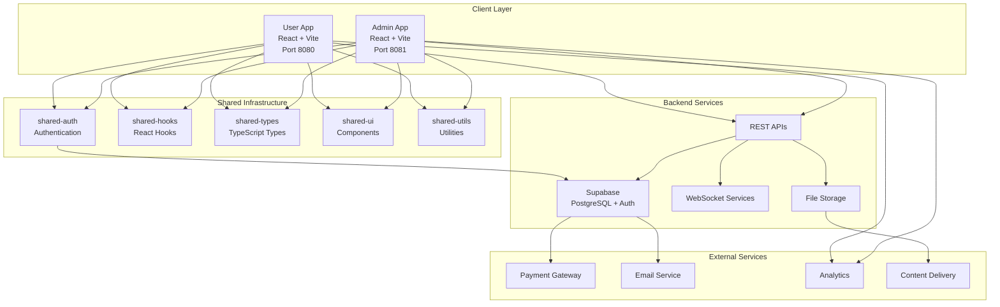
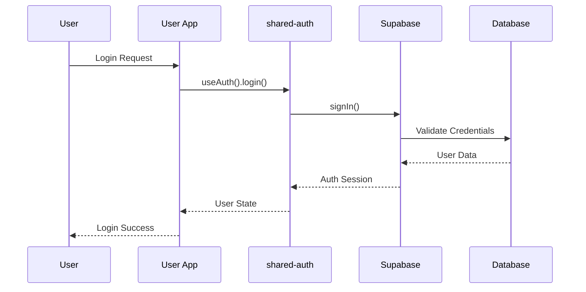
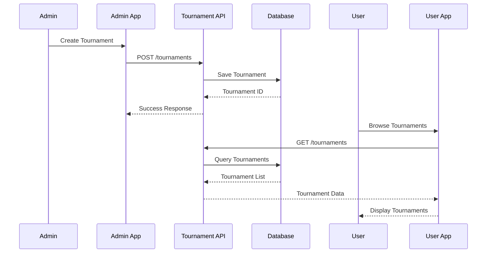
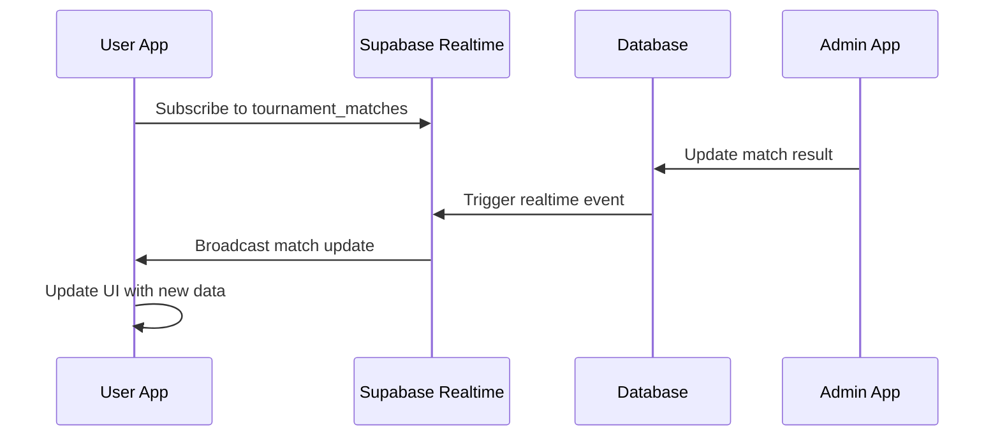
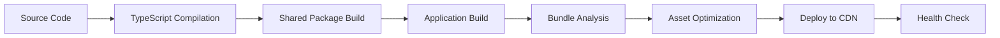

# 🏗️ SABO Arena Architecture Documentation

## 📋 System Overview

SABO Arena is a modern, scalable tournament management platform built with a monorepo architecture, featuring separate user and admin applications backed by shared packages for maximum code reusability and maintainability.

---

## 🎯 Architecture Principles

### 1. **Separation of Concerns**
- **User App**: Customer-facing tournament participation
- **Admin App**: Administrative management and monitoring
- **Shared Packages**: Common functionality and business logic

### 2. **Scalability & Performance**
- **Bundle Splitting**: Optimized chunk loading strategies
- **Code Sharing**: Reduced duplication via shared packages
- **Build Optimization**: Advanced Vite configurations

### 3. **Developer Experience**
- **Type Safety**: Full TypeScript coverage
- **Hot Reloading**: Instant development feedback
- **Automated Testing**: Integrated quality assurance

---

## 🏛️ System Architecture Diagram



---

## 📦 Package Architecture

### Monorepo Structure

```
sabo-pool-v12/
├── apps/
│   ├── sabo-user/              # User Application
│   │   ├── src/
│   │   │   ├── components/     # App-specific components
│   │   │   ├── pages/          # Route components
│   │   │   ├── hooks/          # App-specific hooks
│   │   │   ├── services/       # API services
│   │   │   ├── utils/          # App utilities
│   │   │   ├── types/          # App types
│   │   │   └── main.tsx        # Application entry
│   │   ├── public/             # Static assets
│   │   └── vite.config.ts      # Build configuration
│   │
│   └── sabo-admin/             # Admin Application
│       ├── src/
│       │   ├── components/     # Admin components
│       │   ├── pages/          # Admin pages
│       │   ├── hooks/          # Admin hooks
│       │   └── services/       # Admin services
│       └── vite.config.ts      # Admin build config
│
├── packages/
│   ├── shared-auth/            # Authentication Package
│   │   ├── src/
│   │   │   ├── providers/      # Auth providers
│   │   │   ├── hooks/          # Auth hooks
│   │   │   ├── types/          # Auth types
│   │   │   └── utils/          # Auth utilities
│   │   └── package.json
│   │
│   ├── shared-hooks/           # React Hooks Package
│   │   ├── src/
│   │   │   ├── useLocalStorage.ts
│   │   │   ├── useDebounce.ts
│   │   │   └── index.ts
│   │   └── package.json
│   │
│   ├── shared-types/           # TypeScript Types
│   │   ├── src/
│   │   │   ├── user.ts
│   │   │   ├── tournament.ts
│   │   │   ├── challenge.ts
│   │   │   └── index.ts
│   │   └── package.json
│   │
│   ├── shared-ui/              # UI Components
│   │   ├── src/
│   │   │   ├── components/
│   │   │   │   ├── Button/
│   │   │   │   ├── Modal/
│   │   │   │   └── Card/
│   │   │   └── index.ts
│   │   └── package.json
│   │
│   └── shared-utils/           # Utility Functions
│       ├── src/
│       │   ├── formatters.ts
│       │   ├── validators.ts
│       │   ├── helpers.ts
│       │   └── index.ts
│       └── package.json
│
└── scripts/                    # Build & Development Scripts
    ├── build-optimized.sh
    ├── dev-optimized.sh
    └── bundle-analyzer.sh
```

---

## 🔄 Data Flow Architecture

### Authentication Flow



### Tournament Management Flow



### Real-time Updates Flow



---

## 🧩 Component Architecture

### Shared UI Component Structure

```typescript
// Component Interface
interface ComponentProps {
  variant?: 'primary' | 'secondary' | 'danger';
  size?: 'sm' | 'md' | 'lg';
  disabled?: boolean;
  children: React.ReactNode;
  className?: string;
}

// Component Implementation
export const Component: React.FC<ComponentProps> = ({
  variant = 'primary',
  size = 'md',
  disabled = false,
  children,
  className = '',
  ...props
}) => {
  const baseClasses = 'px-4 py-2 rounded-md font-medium transition-colors';
  const variantClasses = {
    primary: 'bg-blue-600 text-white hover:bg-blue-700',
    secondary: 'bg-gray-200 text-gray-900 hover:bg-gray-300',
    danger: 'bg-red-600 text-white hover:bg-red-700',
  };
  
  return (
    <button
      className={`${baseClasses} ${variantClasses[variant]} ${className}`}
      disabled={disabled}
      {...props}
    >
      {children}
    </button>
  );
};
```

### Hook Architecture Pattern

```typescript
// Custom Hook Pattern
export const useResource = <T>(endpoint: string) => {
  const [data, setData] = useState<T | null>(null);
  const [loading, setLoading] = useState(true);
  const [error, setError] = useState<string | null>(null);
  
  const fetchData = useCallback(async () => {
    try {
      setLoading(true);
      setError(null);
      const response = await fetch(endpoint);
      const result = await response.json();
      setData(result);
    } catch (err) {
      setError(err instanceof Error ? err.message : 'Unknown error');
    } finally {
      setLoading(false);
    }
  }, [endpoint]);
  
  useEffect(() => {
    fetchData();
  }, [fetchData]);
  
  return { data, loading, error, refetch: fetchData };
};
```

---

## 🔧 Build Architecture

### Vite Configuration Strategy

```typescript
// Shared Build Configuration
export const createSABOViteConfig = (options: ConfigOptions) => {
  return defineConfig({
    plugins: [react()],
    resolve: {
      alias: {
        "@": path.resolve(__dirname, "./src"),
        "@sabo/shared-ui": path.resolve(__dirname, "../../packages/shared-ui/src"),
        "@sabo/shared-types": path.resolve(__dirname, "../../packages/shared-types/src"),
        "@sabo/shared-utils": path.resolve(__dirname, "../../packages/shared-utils/src"),
        "@sabo/shared-hooks": path.resolve(__dirname, "../../packages/shared-hooks/src"),
        "@sabo/shared-auth": path.resolve(__dirname, "../../packages/shared-auth/src"),
      },
    },
    build: {
      rollupOptions: {
        output: {
          manualChunks: {
            'react-vendor': ['react', 'react-dom'],
            'react-router': ['react-router-dom'],
            'data-layer': ['@tanstack/react-query', '@supabase/supabase-js'],
            'ui-vendor': ['lucide-react', 'class-variance-authority', 'clsx'],
            ...options.additionalChunks,
          },
        },
      },
    },
  });
};
```

### Bundle Optimization Strategy

```bash
# Bundle Size Targets
React Vendor Chunk: ~142KB
Data Layer Chunk: ~160KB
UI Vendor Chunk: ~56KB
App-specific Chunks: <100KB each
Total App Size: <15MB
```

---

## 📊 Performance Architecture

### Bundle Analysis Results

| Application | Total Size | JS Files | CSS Files | Largest Chunk |
|-------------|------------|----------|-----------|---------------|
| User App    | 12M        | 109      | 3         | 344KB        |
| Admin App   | 2.0M       | 8        | 1         | 142KB        |

### Performance Optimizations

1. **Code Splitting**: Strategic chunk division
2. **Tree Shaking**: Unused code elimination
3. **Asset Optimization**: Image and font optimization
4. **Cache Strategies**: Effective browser caching
5. **Bundle Analysis**: Continuous size monitoring

### Loading Strategy

```typescript
// Lazy Loading Pattern
const LazyComponent = lazy(() => 
  import('./HeavyComponent').then(module => ({
    default: module.HeavyComponent
  }))
);

// Route-based Code Splitting
const routes = [
  {
    path: '/tournaments',
    component: lazy(() => import('./pages/TournamentsPage')),
  },
  {
    path: '/challenges',
    component: lazy(() => import('./pages/ChallengesPage')),
  },
];
```

---

## 🔒 Security Architecture

### Authentication & Authorization

```typescript
// Auth Context Pattern
export const AuthProvider: React.FC<{ children: React.ReactNode }> = ({ children }) => {
  const [user, setUser] = useState<User | null>(null);
  const [loading, setLoading] = useState(true);
  
  const login = async (credentials: LoginCredentials) => {
    const { user, session } = await supabase.auth.signIn(credentials);
    setUser(user);
    return { user, session };
  };
  
  const logout = async () => {
    await supabase.auth.signOut();
    setUser(null);
  };
  
  return (
    <AuthContext.Provider value={{ user, login, logout, loading }}>
      {children}
    </AuthContext.Provider>
  );
};
```

### Route Protection

```typescript
// Protected Route Component
export const ProtectedRoute: React.FC<{ children: React.ReactNode; requiredRole?: UserRole }> = ({
  children,
  requiredRole,
}) => {
  const { user, loading } = useAuth();
  
  if (loading) return <LoadingSpinner />;
  
  if (!user) {
    return <Navigate to="/login" replace />;
  }
  
  if (requiredRole && user.role !== requiredRole) {
    return <Navigate to="/unauthorized" replace />;
  }
  
  return <>{children}</>;
};
```

---

## 🧪 Testing Architecture

### Testing Strategy

```typescript
// Component Testing Pattern
describe('Tournament Card Component', () => {
  const mockTournament: Tournament = {
    id: '1',
    name: 'Test Tournament',
    status: 'active',
    participants: 16,
  };
  
  test('renders tournament information correctly', () => {
    render(<TournamentCard tournament={mockTournament} />);
    
    expect(screen.getByText('Test Tournament')).toBeInTheDocument();
    expect(screen.getByText('16 participants')).toBeInTheDocument();
  });
  
  test('handles registration click', async () => {
    const onRegister = jest.fn();
    render(<TournamentCard tournament={mockTournament} onRegister={onRegister} />);
    
    fireEvent.click(screen.getByText('Register'));
    expect(onRegister).toHaveBeenCalledWith(mockTournament.id);
  });
});
```

### Integration Testing

```typescript
// API Integration Test
describe('Tournament Service', () => {
  test('fetches tournaments successfully', async () => {
    const tournaments = await tournamentService.fetchTournaments();
    
    expect(tournaments).toHaveLength(expect.any(Number));
    expect(tournaments[0]).toHaveProperty('id');
    expect(tournaments[0]).toHaveProperty('name');
  });
});
```

---

## 📱 Responsive Architecture

### Breakpoint Strategy

```css
/* Tailwind CSS Breakpoints */
sm: 640px   /* Small devices */
md: 768px   /* Medium devices */
lg: 1024px  /* Large devices */
xl: 1280px  /* Extra large devices */
2xl: 1536px /* 2X large devices */
```

### Component Responsiveness

```typescript
// Responsive Component Pattern
export const ResponsiveLayout: React.FC = ({ children }) => {
  const [isMobile, setIsMobile] = useState(false);
  
  useEffect(() => {
    const checkDevice = () => {
      setIsMobile(window.innerWidth < 768);
    };
    
    checkDevice();
    window.addEventListener('resize', checkDevice);
    
    return () => window.removeEventListener('resize', checkDevice);
  }, []);
  
  return (
    <div className={`layout ${isMobile ? 'mobile-layout' : 'desktop-layout'}`}>
      {children}
    </div>
  );
};
```

---

## 🔄 State Management Architecture

### Global State Pattern

```typescript
// Zustand Store Pattern
interface AppState {
  user: User | null;
  tournaments: Tournament[];
  loading: boolean;
  setUser: (user: User | null) => void;
  setTournaments: (tournaments: Tournament[]) => void;
  setLoading: (loading: boolean) => void;
}

export const useAppStore = create<AppState>((set) => ({
  user: null,
  tournaments: [],
  loading: false,
  setUser: (user) => set({ user }),
  setTournaments: (tournaments) => set({ tournaments }),
  setLoading: (loading) => set({ loading }),
}));
```

### Server State Management

```typescript
// React Query Pattern
export const useTournaments = () => {
  return useQuery({
    queryKey: ['tournaments'],
    queryFn: () => tournamentService.fetchTournaments(),
    staleTime: 5 * 60 * 1000, // 5 minutes
    cacheTime: 10 * 60 * 1000, // 10 minutes
  });
};

export const useCreateTournament = () => {
  const queryClient = useQueryClient();
  
  return useMutation({
    mutationFn: tournamentService.createTournament,
    onSuccess: () => {
      queryClient.invalidateQueries(['tournaments']);
    },
  });
};
```

---

## 📈 Monitoring & Analytics Architecture

### Performance Monitoring

```typescript
// Performance Tracking
export const performanceMonitor = {
  trackPageLoad: (pageName: string) => {
    const loadTime = performance.now();
    analytics.track('page_load', {
      page: pageName,
      load_time: loadTime,
    });
  },
  
  trackUserAction: (action: string, data?: Record<string, any>) => {
    analytics.track('user_action', {
      action,
      timestamp: Date.now(),
      ...data,
    });
  },
};
```

### Error Monitoring

```typescript
// Error Boundary Pattern
export class ErrorBoundary extends Component<Props, State> {
  constructor(props: Props) {
    super(props);
    this.state = { hasError: false };
  }
  
  static getDerivedStateFromError(error: Error): State {
    return { hasError: true };
  }
  
  componentDidCatch(error: Error, errorInfo: ErrorInfo) {
    console.error('Error caught by boundary:', error, errorInfo);
    
    // Send to monitoring service
    errorService.captureException(error, {
      context: errorInfo,
      user: this.props.user,
    });
  }
  
  render() {
    if (this.state.hasError) {
      return <ErrorFallback onRetry={() => this.setState({ hasError: false })} />;
    }
    
    return this.props.children;
  }
}
```

---

## 🚀 Deployment Architecture

### Build Pipeline



### Environment Strategy

| Environment | Purpose | URL | Branch |
|-------------|---------|-----|--------|
| Development | Local development | localhost:8080/8081 | feature/* |
| Staging | Pre-production testing | staging.saboarena.com | develop |
| Production | Live application | saboarena.com | main |

---

## 📚 Best Practices & Guidelines

### Code Organization

1. **Feature-based Structure**: Group related functionality
2. **Consistent Naming**: Use descriptive, consistent names
3. **Single Responsibility**: One purpose per component/function
4. **DRY Principle**: Avoid code duplication via shared packages

### Performance Guidelines

1. **Bundle Size**: Keep chunks under 500KB
2. **Lazy Loading**: Use for non-critical components
3. **Memoization**: Optimize expensive computations
4. **Image Optimization**: Use appropriate formats and sizes

### Security Best Practices

1. **Input Validation**: Validate all user inputs
2. **Authentication**: Secure all protected routes
3. **Authorization**: Implement role-based access control
4. **Data Sanitization**: Prevent XSS and injection attacks

---

## 🔮 Future Architecture Considerations

### Scalability Enhancements

1. **Micro-frontends**: Consider for further app separation
2. **Edge Computing**: Implement edge caching strategies
3. **Real-time Features**: Expand WebSocket usage
4. **Mobile Apps**: React Native shared component library

### Technical Debt Management

1. **Legacy Code Cleanup**: Address TypeScript errors in user app
2. **Dependency Updates**: Regular package updates
3. **Performance Optimization**: Continuous bundle size monitoring
4. **Test Coverage**: Improve automated testing coverage

---

*Last Updated: August 28, 2025 - SABO Arena Architecture v1.0.0*
