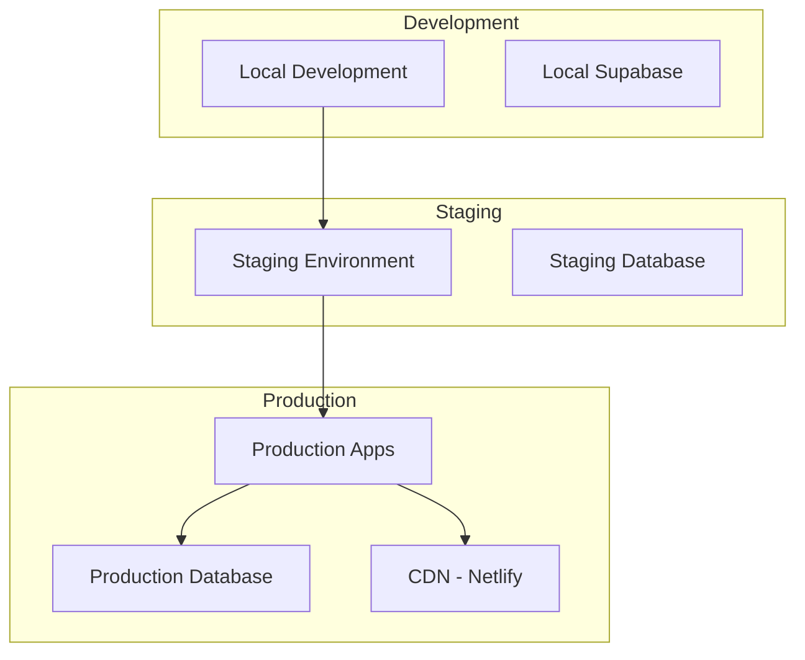

# 🚀 SABO POOL - DEPLOYMENT GUIDE

## 📋 Overview

Hướng dẫn triển khai chi tiết cho SABO Pool, bao gồm cả development và production environments.

## 🏗️ Architecture Overview



## 🏗️ Architecture Overview

```
SABO Arena Monorepo
├── apps/
│   ├── sabo-user/          # User-facing application (Port 8080)
│   └── sabo-admin/         # Admin dashboard (Port 8081)
├── packages/
│   ├── shared-auth/        # Authentication & authorization
│   ├── shared-hooks/       # Reusable React hooks
│   ├── shared-types/       # TypeScript type definitions
│   ├── shared-ui/          # UI components library
│   └── shared-utils/       # Utility functions
└── scripts/                # Build & deployment automation
```

---

## 🛠️ Prerequisites

### System Requirements:
- **Node.js**: v20.14.0+ (LTS)
- **pnpm**: v9.0.0+ (Package manager)
- **Git**: Latest stable version
- **Docker**: v24.0+ (optional, for containerized deployment)

### Environment Setup:
```bash
# Install Node.js (using nvm recommended)
curl -o- https://raw.githubusercontent.com/nvm-sh/nvm/v0.39.0/install.sh | bash
nvm install 20.14.0
nvm use 20.14.0

# Install pnpm
npm install -g pnpm@latest

# Verify installations
node --version  # Should output v20.14.0+
pnpm --version  # Should output 9.0.0+
```

---

## 🔧 Environment Configuration

### 1. Environment Variables

Create environment files for each application:

#### User App (`.env.production`):
```env
# Application
VITE_APP_NAME=SABO Arena
VITE_APP_VERSION=1.0.0
VITE_APP_ENV=production

# Supabase Configuration
VITE_SUPABASE_URL=your_supabase_url
VITE_SUPABASE_ANON_KEY=your_supabase_anon_key

# API Endpoints
VITE_API_BASE_URL=https://api.saboarena.com
VITE_WEBSOCKET_URL=wss://ws.saboarena.com

# Analytics
VITE_GOOGLE_ANALYTICS_ID=GA-XXXXXXXXX
VITE_SENTRY_DSN=your_sentry_dsn

# Feature Flags
VITE_ENABLE_TOURNAMENTS=true
VITE_ENABLE_CHALLENGES=true
VITE_ENABLE_CLUBS=true
```

#### Admin App (`.env.production`):
```env
# Application
VITE_APP_NAME=SABO Arena Admin
VITE_APP_VERSION=1.0.0
VITE_APP_ENV=production

# Supabase Configuration
VITE_SUPABASE_URL=your_supabase_url
VITE_SUPABASE_ANON_KEY=your_supabase_anon_key

# Admin Features
VITE_ADMIN_API_URL=https://admin-api.saboarena.com
VITE_ENABLE_SYSTEM_MONITORING=true
VITE_ENABLE_USER_MANAGEMENT=true

# Security
VITE_ADMIN_SESSION_TIMEOUT=3600
VITE_REQUIRE_2FA=true
```

---

## 🔨 Build Process

### 1. Optimized Production Build

```bash
# Clone repository
git clone https://github.com/longsangsabo/sabo-pool-v12.git
cd sabo-pool-v12

# Install dependencies
pnpm install

# Run optimized build script
./scripts/build-optimized.sh
```

### 2. Manual Build Steps (if needed)

```bash
# Build shared packages first
pnpm -r --filter "@sabo/shared-*" build

# Build applications
pnpm -F @sabo/user-app build
pnpm -F @sabo/admin-app build

# Verify builds
ls -la apps/sabo-user/dist/
ls -la apps/sabo-admin/dist/
```

### 3. Build Verification

```bash
# Run bundle analyzer
./scripts/bundle-analyzer.sh

# Check build integrity
./scripts/simple-integration-test.sh
```

---

## 🌐 Deployment Strategies

### Option 1: Vercel Deployment (Recommended)

#### User App Deployment:
```bash
# Install Vercel CLI
npm i -g vercel

# Deploy user app
cd apps/sabo-user
vercel --prod

# Configure domains
vercel domains add saboarena.com
vercel alias set sabo-user-xxx.vercel.app saboarena.com
```

#### Admin App Deployment:
```bash
# Deploy admin app
cd apps/sabo-admin
vercel --prod

# Configure admin domain
vercel alias set sabo-admin-xxx.vercel.app admin.saboarena.com
```

### Option 2: Docker Deployment

#### Build Docker Images:
```dockerfile
# Dockerfile.user
FROM node:20-alpine AS builder
WORKDIR /app
COPY package*.json pnpm-lock.yaml ./
RUN npm install -g pnpm && pnpm install
COPY . .
RUN pnpm -F @sabo/user-app build

FROM nginx:alpine
COPY --from=builder /app/apps/sabo-user/dist /usr/share/nginx/html
COPY nginx.conf /etc/nginx/nginx.conf
EXPOSE 80
CMD ["nginx", "-g", "daemon off;"]
```

#### Deploy with Docker Compose:
```yaml
version: '3.8'
services:
  sabo-user:
    build:
      context: .
      dockerfile: Dockerfile.user
    ports:
      - "80:80"
    environment:
      - NODE_ENV=production
    
  sabo-admin:
    build:
      context: .
      dockerfile: Dockerfile.admin
    ports:
      - "81:80"
    environment:
      - NODE_ENV=production
```

### Option 3: Static File Hosting

#### AWS S3 + CloudFront:
```bash
# Build applications
./scripts/build-optimized.sh

# Upload to S3
aws s3 sync apps/sabo-user/dist/ s3://saboarena-user-app --delete
aws s3 sync apps/sabo-admin/dist/ s3://saboarena-admin-app --delete

# Invalidate CloudFront cache
aws cloudfront create-invalidation --distribution-id E123456789 --paths "/*"
```

---

## 🔒 Security Configuration

### 1. Content Security Policy
```nginx
add_header Content-Security-Policy "default-src 'self'; script-src 'self' 'unsafe-inline' https://analytics.google.com; style-src 'self' 'unsafe-inline'; img-src 'self' data: https:; connect-src 'self' https://api.saboarena.com wss://ws.saboarena.com";
```

### 2. SSL/TLS Configuration
```nginx
ssl_protocols TLSv1.2 TLSv1.3;
ssl_ciphers ECDHE-RSA-AES256-GCM-SHA512:DHE-RSA-AES256-GCM-SHA512;
ssl_prefer_server_ciphers off;
add_header Strict-Transport-Security "max-age=63072000" always;
```

---

## 📊 Performance Optimization

### 1. CDN Configuration
- **Static Assets**: Serve JS, CSS, images via CDN
- **Cache Headers**: Set appropriate cache durations
- **Compression**: Enable gzip/brotli compression

### 2. Monitoring Setup
```bash
# Performance monitoring
./scripts/performance-monitor.sh

# Bundle analysis reports
./scripts/bundle-analyzer.sh
```

---

## 🔍 Health Checks & Monitoring

### Application Health Endpoints:
- **User App**: `https://saboarena.com/health`
- **Admin App**: `https://admin.saboarena.com/health`

### Monitoring Metrics:
- **Build Size**: User App (12M), Admin App (2.0M)
- **Load Time**: Target <3s initial load
- **Bundle Performance**: All chunks <500KB
- **Error Rate**: Target <0.1%

---

## 🚨 Troubleshooting

### Common Issues:

#### Build Failures:
```bash
# Clear cache and rebuild
pnpm store prune
rm -rf node_modules apps/*/node_modules packages/*/node_modules
pnpm install
./scripts/build-optimized.sh
```

#### TypeScript Errors:
```bash
# Check TypeScript compilation
pnpm -F @sabo/user-app tsc --noEmit
pnpm -F @sabo/admin-app tsc --noEmit
```

#### Performance Issues:
```bash
# Analyze bundle sizes
./scripts/bundle-analyzer.sh

# Check for large dependencies
npx webpack-bundle-analyzer apps/sabo-user/dist/stats.json
```

---

## 📝 Deployment Checklist

- [ ] Environment variables configured
- [ ] Dependencies installed (`pnpm install`)
- [ ] Shared packages built successfully
- [ ] Applications built without errors
- [ ] Bundle sizes within acceptable limits
- [ ] TypeScript compilation passes
- [ ] Integration tests pass
- [ ] Security headers configured
- [ ] SSL certificates installed
- [ ] CDN configured for static assets
- [ ] Monitoring and analytics setup
- [ ] Health checks implemented
- [ ] Error tracking configured

---

## 🎯 Next Steps

1. **Post-Deployment Testing**: Verify all functionality in production
2. **Performance Monitoring**: Set up ongoing performance tracking
3. **User Acceptance Testing**: Coordinate with stakeholders
4. **Documentation Updates**: Keep deployment docs current

---

*Last Updated: August 28, 2025 - SABO Arena v1.0.0*
