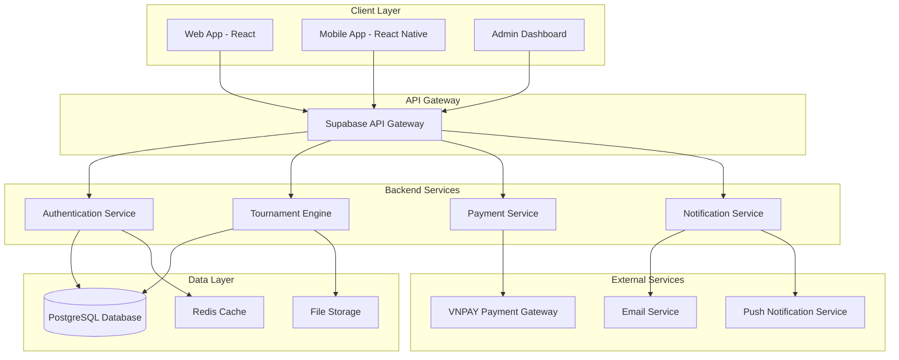
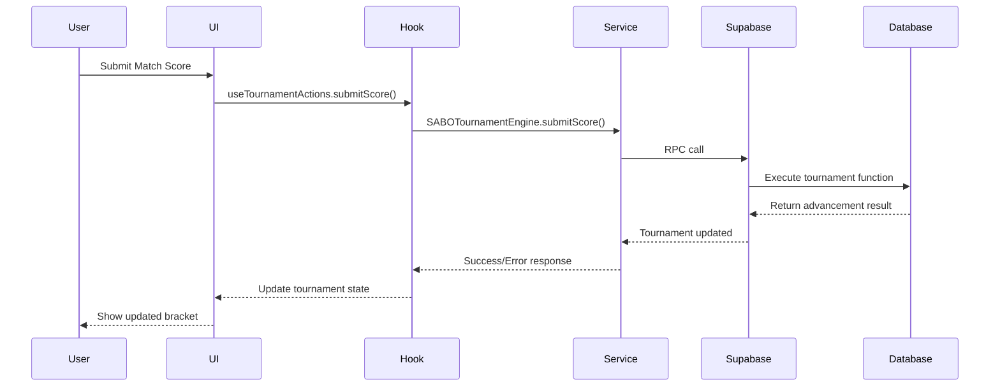
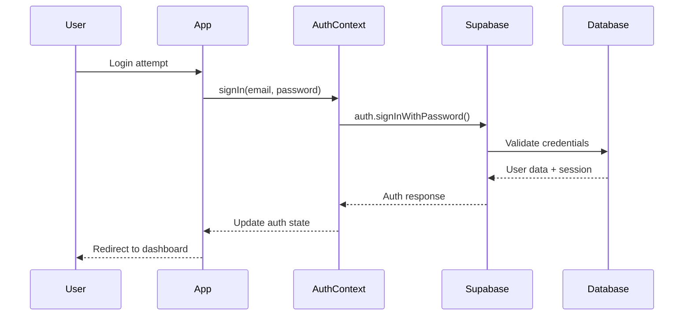

# 🏗️ SABO POOL - TECHNICAL ARCHITECTURE

## 📋 Architecture Overview

SABO Pool sử dụng kiến trúc monorepo hiện đại với separation of concerns rõ ràng, tối ưu hóa cho performance và scalability.

## 🎯 Design Principles

### 1. Domain-Driven Design (DDD)
- **Tournament Domain**: Logic quản lý giải đấu
- **Player Domain**: Quản lý người chơi và ranking
- **Club Domain**: Quản lý club và membership
- **Payment Domain**: Xử lý thanh toán và transactions

### 2. Clean Architecture
```
┌─────────────────────────────────────────┐
│               Presentation              │  ← React Components & Pages
├─────────────────────────────────────────┤
│               Application               │  ← Hooks & Context
├─────────────────────────────────────────┤
│                 Domain                  │  ← Business Logic & Types
├─────────────────────────────────────────┤
│              Infrastructure             │  ← Supabase & External APIs
└─────────────────────────────────────────┘
```

### 3. Monorepo Benefits
- **Code Sharing**: Shared packages cho business logic
- **Consistency**: Unified tooling và standards
- **Developer Experience**: Single repository, multiple apps
- **Atomic Changes**: Cross-package changes trong single commit

## 🏗️ System Architecture

### High-Level Architecture


## 📁 Project Structure Deep Dive

### Apps Directory (`/apps`)

#### User Application (`sabo-user`)
```
src/
├── components/           # React Components (363 files)
│   ├── ui/              # Base UI components (buttons, inputs, etc.)
│   ├── tournament/      # Tournament-specific components
│   ├── club/            # Club management components
│   ├── profile/         # User profile components
│   └── shared/          # Cross-feature shared components
├── pages/               # Route-level pages (129 files)
│   ├── auth/            # Authentication pages
│   ├── tournament/      # Tournament-related pages
│   ├── club/            # Club management pages
│   └── dashboard/       # User dashboard pages
├── hooks/               # Custom React hooks (203 files)
│   ├── tournament/      # Tournament-specific hooks
│   ├── auth/            # Authentication hooks
│   ├── club/            # Club management hooks
│   └── shared/          # Cross-feature hooks
├── contexts/            # React Context providers (20 files)
├── services/            # Business logic services (32 files)
├── utils/               # Utility functions (56 files)
├── types/               # TypeScript type definitions (21 files)
└── integrations/        # External service integrations (4 files)
```

#### Admin Application (`sabo-admin`)
```
src/
├── components/          # Admin-specific components (2 files)
├── pages/               # Admin pages (22 files)
└── lib/                 # Admin utilities
```

### Shared Packages (`/packages`)

#### Shared Authentication (`shared-auth`)
```typescript
// Core authentication logic
export interface AuthState {
  user: User | null;
  session: Session | null;
  loading: boolean;
}

export class AuthService {
  static async signIn(email: string, password: string): Promise<AuthResponse>
  static async signUp(userData: SignUpData): Promise<AuthResponse>
  static async signOut(): Promise<void>
  static async refreshSession(): Promise<Session>
}
```

#### Shared Types (`shared-types`)
```typescript
// Core domain types
export interface Tournament {
  id: string;
  name: string;
  tournament_type: TournamentType;
  status: TournamentStatus;
  // ... other properties
}

export interface Player {
  id: string;
  elo_points: number;
  spa_points: number;
  rank: RankCode;
  // ... other properties
}
```

#### Shared Hooks (`shared-hooks`)
```typescript
// Reusable business logic hooks
export function useTournament(tournamentId: string) {
  // Tournament state management
}

export function usePlayerRanking(playerId: string) {
  // Player ranking logic
}
```

#### Shared UI (`shared-ui`)
```typescript
// Base UI component library
export { Button } from './Button';
export { Input } from './Input';
export { Modal } from './Modal';
export { DataTable } from './DataTable';
```

#### Shared Utils (`shared-utils`)
```typescript
// Common utility functions
export function calculateEloChange(
  playerElo: number,
  opponentElo: number,
  result: MatchResult
): number

export function formatCurrency(amount: number): string

export function validateTournamentData(data: TournamentData): ValidationResult
```

## 🛠️ Technology Stack Details

### Frontend Architecture

#### React 18.3.1 Features
- **Concurrent Features**: Automatic batching, Suspense, Transitions
- **React 18 Hooks**: useId, useDeferredValue, useTransition
- **Server Components**: Ready for future SSR implementation
- **Strict Mode**: Development safety and future compatibility

#### TypeScript 5.9.2 Configuration
```typescript
// tsconfig.json
{
  "compilerOptions": {
    "strict": true,                    // Maximum type safety
    "noUncheckedIndexedAccess": true, // Array safety
    "exactOptionalPropertyTypes": true, // Precision
    "noImplicitReturns": true,        // Control flow
    "noFallthroughCasesInSwitch": true // Switch safety
  }
}
```

#### Vite 5.4.19 Build Configuration
```typescript
// vite.config.ts
export default defineConfig({
  build: {
    rollupOptions: {
      output: {
        manualChunks: {
          'react-vendor': ['react', 'react-dom'],
          'ui-vendor': ['@radix-ui/react-*'],
          'data-layer': ['@supabase/supabase-js']
        }
      }
    }
  },
  optimizeDeps: {
    include: ['react', 'react-dom', '@supabase/supabase-js']
  }
})
```

### Backend Architecture

#### Supabase Stack
```sql
-- Core Tables Structure
tournaments (
  id UUID PRIMARY KEY,
  name TEXT NOT NULL,
  tournament_type tournament_type_enum,
  status tournament_status_enum,
  created_at TIMESTAMP WITH TIME ZONE,
  -- ... other columns
);

tournament_matches (
  id UUID PRIMARY KEY,
  tournament_id UUID REFERENCES tournaments(id),
  round_number INTEGER,
  player1_id UUID REFERENCES auth.users(id),
  player2_id UUID REFERENCES auth.users(id),
  winner_id UUID REFERENCES auth.users(id),
  -- ... other columns
);

player_rankings (
  user_id UUID PRIMARY KEY REFERENCES auth.users(id),
  elo_points INTEGER DEFAULT 1000,
  spa_points INTEGER DEFAULT 0,
  rank rank_code_enum DEFAULT 'K',
  -- ... other columns
);
```

#### Database Functions
```sql
-- Tournament advancement logic
CREATE OR REPLACE FUNCTION advance_sabo_tournament_fixed(
  p_tournament_id UUID,
  p_completed_match_id UUID,
  p_winner_id UUID
) RETURNS JSONB;

-- ELO calculation
CREATE OR REPLACE FUNCTION process_tournament_match_elo(
  p_match_id UUID,
  p_winner_id UUID,
  p_loser_id UUID
) RETURNS JSONB;
```

#### Real-time Subscriptions
```typescript
// Real-time tournament updates
const subscription = supabase
  .channel(`tournament_${tournamentId}`)
  .on('postgres_changes', {
    event: '*',
    schema: 'public',
    table: 'tournament_matches',
    filter: `tournament_id=eq.${tournamentId}`
  }, handleMatchUpdate)
  .subscribe();
```

## 🔄 Data Flow Architecture

### Tournament Flow


### Authentication Flow


## 🚀 Performance Architecture

### Bundle Optimization
```typescript
// Code splitting strategy
const TournamentPage = lazy(() => import('./pages/TournamentPage'));
const ClubManagement = lazy(() => import('./pages/ClubManagement'));

// Route-based splitting
const router = createBrowserRouter([
  {
    path: "/tournaments",
    element: <Suspense fallback={<Loading />}><TournamentPage /></Suspense>
  }
]);
```

### Caching Strategy
```typescript
// React Query for server state
const { data: tournaments } = useQuery({
  queryKey: ['tournaments', filters],
  queryFn: () => TournamentService.getTournaments(filters),
  staleTime: 5 * 60 * 1000, // 5 minutes
  cacheTime: 10 * 60 * 1000 // 10 minutes
});

// Local storage for user preferences
const usePersistedState = (key: string, defaultValue: any) => {
  const [state, setState] = useState(() => {
    const saved = localStorage.getItem(key);
    return saved ? JSON.parse(saved) : defaultValue;
  });
  
  useEffect(() => {
    localStorage.setItem(key, JSON.stringify(state));
  }, [key, state]);
  
  return [state, setState];
};
```

### Memory Management
```typescript
// Cleanup subscriptions
useEffect(() => {
  const subscription = supabase
    .channel('tournament_updates')
    .subscribe();
    
  return () => {
    subscription.unsubscribe();
  };
}, []);

// Debounced search
const debouncedSearch = useCallback(
  debounce((query: string) => {
    performSearch(query);
  }, 300),
  []
);
```

## 🔒 Security Architecture

### Authentication & Authorization
```typescript
// Row Level Security (RLS) policies
CREATE POLICY "Users can view public tournaments"
ON tournaments
FOR SELECT
USING (status = 'registration_open' OR status = 'ongoing');

CREATE POLICY "Club owners can manage their tournaments"
ON tournaments
FOR ALL
USING (auth.uid() = created_by);
```

### Input Validation
```typescript
// Zod schema validation
const tournamentSchema = z.object({
  name: z.string().min(3).max(100),
  tournament_type: z.enum(['single_elimination', 'double_elimination']),
  max_participants: z.number().min(4).max(32),
  entry_fee: z.number().min(0)
});

// Runtime validation
export function validateTournamentData(data: unknown): Tournament {
  return tournamentSchema.parse(data);
}
```

### API Security
```typescript
// Request rate limiting
const rateLimiter = rateLimit({
  windowMs: 15 * 60 * 1000, // 15 minutes
  max: 100, // limit each IP to 100 requests per windowMs
  message: 'Too many requests, please try again later'
});

// CORS configuration
const corsOptions = {
  origin: process.env.NODE_ENV === 'production' 
    ? ['https://sabo-pool.com'] 
    : ['http://localhost:3000'],
  credentials: true
};
```

## 📊 Monitoring & Observability

### Performance Monitoring
```typescript
// Web Vitals tracking
export function trackWebVitals(metric: Metric) {
  switch (metric.name) {
    case 'CLS':
    case 'FID':
    case 'FCP':
    case 'LCP':
    case 'TTFB':
      analytics.track('web_vital', {
        name: metric.name,
        value: metric.value,
        page: window.location.pathname
      });
      break;
  }
}
```

### Error Tracking
```typescript
// Error boundary with Sentry integration
class ErrorBoundary extends Component {
  componentDidCatch(error: Error, errorInfo: ErrorInfo) {
    Sentry.captureException(error, {
      contexts: {
        react: {
          componentStack: errorInfo.componentStack
        }
      }
    });
  }
}
```

### Usage Analytics
```typescript
// Custom analytics tracking
export const analytics = {
  track: (event: string, properties?: Record<string, any>) => {
    // Send to analytics service
    gtag('event', event, properties);
    
    // Also track in Supabase for internal analytics
    supabase.from('analytics_events').insert({
      event_name: event,
      properties,
      user_id: auth.user?.id,
      timestamp: new Date().toISOString()
    });
  }
};
```

## 🔄 Deployment Architecture

### CI/CD Pipeline
```yaml
# .github/workflows/deploy.yml
name: Deploy to Production
on:
  push:
    branches: [main]
    
jobs:
  test:
    runs-on: ubuntu-latest
    steps:
      - uses: actions/checkout@v3
      - name: Install dependencies
        run: pnpm install
      - name: Run tests
        run: pnpm test
      - name: Type check
        run: pnpm type-check
      - name: Build
        run: pnpm build
        
  deploy:
    needs: test
    runs-on: ubuntu-latest
    steps:
      - name: Deploy to Netlify
        uses: netlify/actions/cli@master
        with:
          args: deploy --prod --dir=dist
```

### Environment Configuration
```typescript
// Environment-specific configs
const config = {
  development: {
    supabaseUrl: 'http://localhost:54321',
    apiUrl: 'http://localhost:3000/api',
    logLevel: 'debug'
  },
  production: {
    supabaseUrl: process.env.VITE_SUPABASE_URL,
    apiUrl: process.env.VITE_API_URL,
    logLevel: 'error'
  }
};
```

---

**Last Updated**: August 30, 2025  
**Version**: 1.0.0  
**Architecture Status**: Production Ready  

> "Scalable, maintainable, and performance-optimized architecture for modern web applications"
