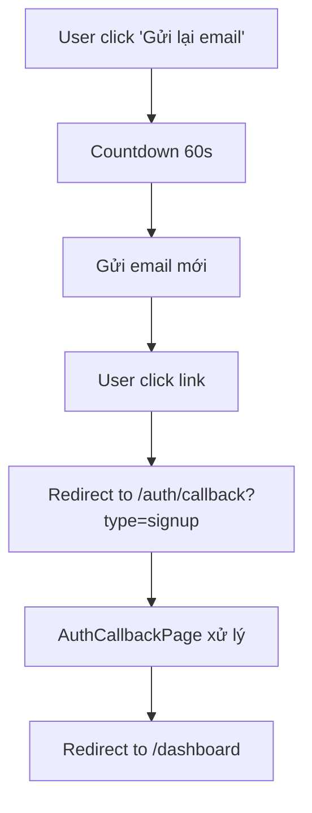

# 🔐 Tài Liệu Hệ Thống Authentication Routes & Callback URLs

## Dự án: SABO Pool Arena Hub v12
## Ngày cập nhật: 9 tháng 8, 2025

---

## 📋 Tổng Quan

Tài liệu này mô tả chi tiết về hệ thống routes xác thực (authentication) và cấu hình callback URLs trong ứng dụng SABO Pool Arena Hub. Hệ thống hỗ trợ nhiều phương thức đăng nhập/đăng ký bao gồm email, số điện thoại, và OAuth social login.

---

## 🛤️ Danh Sách Routes Xác Thực

### 🌐 **Public Auth Routes** 
*(Chỉ truy cập được khi CHƯA đăng nhập)*

| Route | Component | Mô tả |
|-------|-----------|-------|
| `/auth` | `AuthRouteGuard` | Wrapper component cho auth routes |
| `/auth/login` | `EnhancedLoginPage` | Trang đăng nhập chính |
| `/auth/register` | `EnhancedRegisterPage` | Trang đăng ký với OTP verification |
| `/auth/forgot-password` | `ForgotPasswordPage` | Trang quên mật khẩu |
| `/auth/callback` | `AuthCallbackPage` | **Xử lý tất cả auth callbacks** |
| `/login` | `Navigate to /auth/login` | Legacy redirect |
| `/register` | `Navigate to /auth/register` | Legacy redirect |
| `/test/otp` | `OtpTestPage` | Testing OTP functionality |

### 🔒 **Protected Routes** 
*(Yêu cầu đăng nhập)*

#### Core User Routes:
| Route | Component | Mô tả |
|-------|-----------|-------|
| `/dashboard` | `Dashboard` | **Trang chính sau khi đăng nhập** |
| `/profile` | `Profile` | Trang cá nhân |
| `/challenges` | `EnhancedChallengesPageV2` | Thử thách |
| `/community` | `CommunityPage` | Cộng đồng |
| `/calendar` | `CalendarPage` | Lịch thi đấu |
| `/settings` | `SettingsPage` | Cài đặt |
| `/wallet` | `WalletPage` | Ví thanh toán |
| `/club-registration` | `ClubRegistrationPage` | Đăng ký câu lạc bộ |
| `/feed` | `FeedPage` | Bảng tin |
| `/marketplace` | `MarketplacePage` | Chợ phụ kiện |
| `/notifications` | `NotificationsPage` | Thông báo |

#### Public Pages (accessible when logged in):
| Route | Component | Mô tả |
|-------|-----------|-------|
| `/tournaments` | `TournamentPage` | Giải đấu |
| `/leaderboard` | `LeaderboardPage` | Bảng xếp hạng |
| `/clubs` | `ClubsPage` | Danh sách câu lạc bộ |
| `/clubs/:id` | `ClubDetailPage` | Chi tiết câu lạc bộ |
| `/clubs/:id/owner` | `ClubOwnerDashboardPage` | Dashboard chủ CLB |

### 👨‍💼 **Admin Routes**
| Route | Component | Phân quyền |
|-------|-----------|------------|
| `/admin/*` | `AdminRouter` | Requires admin role |

### 🏆 **Club Owner Routes**
| Route | Component | Phân quyền |
|-------|-----------|------------|
| `/club-management/*` | `ClubManagementPage` | Requires club owner privileges |

---

## 🔄 Cấu Hình Supabase Callback URLs

### 📧 **Email Verification Redirects**

#### 1. Email Signup (Đăng ký mới)
```typescript
// File: src/hooks/useAuth.tsx (line 257)
emailRedirectTo: `${window.location.origin}/`
```
- **Luồng**: Đăng ký → Email xác thực → Click link → Trang chủ
- **Logic**: Nếu đã đăng nhập → Auto redirect đến `/dashboard`

#### 2. Email Resend (Gửi lại email xác thực)
```typescript
// File: src/components/EmailVerificationBanner.tsx (line 54)
emailRedirectTo: `${window.location.origin}/auth/callback?type=signup`
```
- **Luồng**: Gửi lại email → Click link → AuthCallback → Dashboard
- **Có countdown timer 60 giây**

### 🌐 **OAuth Social Login Redirects**

#### Google OAuth
```typescript
// File: src/components/SocialLoginButtons.tsx & useAuth.tsx
redirectTo: `${window.location.origin}/auth/callback`
// HOẶC
redirectTo: `${window.location.origin}/`
```

#### Facebook OAuth  
```typescript
// File: src/components/SocialLoginButtons.tsx
redirectTo: `${window.location.origin}/auth/callback`
```

### 📱 **Phone OTP Flow**
- **Không sử dụng URL redirects**
- **Xử lý trực tiếp trong ứng dụng**
- **Có tính năng resend với countdown 60 giây**

---

## ⚡ Luồng Xác Thực Chi Tiết

### 1. 📧 **Email Registration Flow**
```mermaid
graph TD
    A[User nhập email/password] --> B[Gửi email xác thực]
    B --> C[User click link trong email]
    C --> D[Redirect to ${origin}/]
    D --> E{Đã đăng nhập?}
    E -->|Có| F[Auto redirect to /dashboard]
    E -->|Không| G[Ở lại trang chủ]
```

### 2. 🔄 **Email Resend Flow**


### 3. 🌐 **OAuth Flow**
```mermaid
graph TD
    A[User click Google/Facebook] --> B[OAuth provider auth]
    B --> C[Provider redirect to /auth/callback]
    C --> D[AuthCallbackPage xử lý]
    D --> E{Auth thành công?}
    E -->|Có| F[toast.success + navigate('/dashboard')]
    E -->|Không| G[toast.error + navigate('/auth/login')]
```

### 4. 📱 **Phone OTP Flow**
```mermaid
graph TD
    A[User nhập SĐT] --> B[Gửi OTP qua SMS]
    B --> C[Hiển thị OTP dialog]
    C --> D[User nhập OTP]
    D --> E{OTP đúng?}
    E -->|Có| F[navigate('/dashboard')]
    E -->|Không| G[Hiển thị lỗi]
    C --> H[Countdown 60s]
    H --> I[Enable nút 'Gửi lại OTP']
```

---

## 🎯 AuthCallbackPage - Central Handler

### 📁 File: `src/pages/AuthCallbackPage.tsx`

**Chức năng:**
- Xử lý tất cả OAuth và email verification callbacks
- Kiểm tra trạng thái authentication
- Redirect dựa trên kết quả

**Logic:**
```typescript
if (user) {
    toast.success('Đăng nhập thành công!');
    navigate('/dashboard');
} else {
    toast.error('Đăng nhập thất bại. Vui lòng thử lại.');
    navigate('/auth/login');
}
```

---

## 🔧 Cấu Hình Redirect URLs

### 🌍 **Environment Variables**
```bash
# Không có biến môi trường cụ thể cho auth redirects
# Sử dụng dynamic: window.location.origin
```

### 📝 **Code Patterns**
```typescript
// Pattern 1: Homepage redirect
redirectTo: `${window.location.origin}/`

// Pattern 2: Auth callback redirect  
redirectTo: `${window.location.origin}/auth/callback`

// Pattern 3: Email with query params
emailRedirectTo: `${window.location.origin}/auth/callback?type=signup`
```

---

## ⚠️ Điểm Cần Lưu Ý

### � **Vấn Đề Chính**

#### 1. **Inconsistent Redirect Patterns**
```typescript
// Email signup → Homepage
emailRedirectTo: `${window.location.origin}/`

// Email resend → Auth callback  
emailRedirectTo: `${window.location.origin}/auth/callback?type=signup`

// OAuth → Auth callback
redirectTo: `${window.location.origin}/auth/callback`
```
**❌ Problem**: User confusion - khác flow khác destination!

#### 2. **Double Redirect Issue**
```
Email signup → Homepage → Auto redirect dashboard
```
**❌ Inefficient**: 2 redirects thay vì 1

### 🔄 **Legacy Issues**
- **Email signup**: Redirect về homepage (`/`)
- **Email resend**: Redirect về `/auth/callback?type=signup`
- **OAuth**: Redirect về `/auth/callback`

### 🎯 **Landing Pages**
- **Tất cả auth thành công** cuối cùng đều dẫn đến `/dashboard`
- **LandingRoute component** xử lý root path (`/`)
- **Nếu đã đăng nhập** truy cập `/` → Auto redirect `/dashboard`

### 🔒 **Route Protection**
- **PublicRoute**: Chỉ cho user chưa đăng nhập
- **ProtectedRoute**: Yêu cầu authentication
- **AdminRoute**: Yêu cầu admin role
- **ClubOwnerRoute**: Yêu cầu club owner privileges

---

## 💡 Đề Xuất Cải Tiến

### 🎯 **1. Standardize Auth Callbacks**

```typescript
// utils/authConfig.ts
const REDIRECT_URL = `${window.location.origin}/auth/callback`

// Tất cả auth flows sử dụng cùng pattern
export const AUTH_REDIRECTS = {
  // Email signup
  emailSignup: REDIRECT_URL,
  
  // Email resend với type parameter
  emailResend: `${REDIRECT_URL}?type=email_confirm`,
  
  // OAuth providers
  oauth: REDIRECT_URL,
  
  // Phone OTP (no redirect needed)
  phoneOtp: null
}
```

### 🔧 **2. Enhanced AuthCallback với Query Handling**

```typescript
// AuthCallbackPage.tsx - Enhanced version
const AuthCallbackPage = () => {
  const navigate = useNavigate();
  const { user, loading } = useAuth();
  
  useEffect(() => {
    const handleCallback = () => {
      if (loading) return;
      
      const urlParams = new URLSearchParams(window.location.search);
      const type = urlParams.get('type');
      
      if (user) {
        const message = getSuccessMessage(type);
        toast.success(message);
        navigate('/dashboard');
      } else {
        toast.error('Xác thực thất bại. Vui lòng thử lại.');
        navigate('/auth/login');
      }
    };
    
    handleCallback();
  }, [user, loading, navigate]);
  
  // Loading UI...
};

const getSuccessMessage = (type: string | null) => {
  switch (type) {
    case 'email_confirm':
      return 'Email đã được xác thực thành công!';
    case 'signup':
      return 'Đăng ký thành công! Chào mừng bạn!';
    default:
      return 'Đăng nhập thành công!';
  }
};
```

### 🌍 **3. Environment-based Redirects**

```typescript
// utils/authConfig.ts
export const getAuthRedirectUrl = (path = '/auth/callback') => {
  const baseUrl = process.env.NODE_ENV === 'production' 
    ? 'https://saboarena.com'
    : window.location.origin;
  return `${baseUrl}${path}`;
};

// Usage
const redirectUrl = getAuthRedirectUrl();
const emailRedirectUrl = getAuthRedirectUrl('/auth/callback?type=email_confirm');
```

### 🏗️ **4. Architecture Improvements**

#### **Centralized Auth State**
```typescript
// contexts/AuthContext.tsx
interface AuthContextType {
  user: User | null;
  isLoading: boolean;
  lastAuthMethod: 'email' | 'phone' | 'oauth' | null;
  redirectAfterAuth: string; // customizable
  authError: string | null;
}

const AuthContext = createContext<AuthContextType>({
  user: null,
  isLoading: false,
  lastAuthMethod: null,
  redirectAfterAuth: '/dashboard',
  authError: null
});
```

#### **Route Protection Middleware**
```typescript
// components/auth/withAuth.tsx
const withAuth = <P extends object>(
  Component: React.ComponentType<P>, 
  requiredRole?: 'admin' | 'club_owner'
) => {
  return (props: P) => {
    const { user, isLoading } = useAuth();
    
    if (isLoading) return <AuthLoadingOverlay />;
    
    if (!user) {
      return <Navigate to="/auth/login" replace />;
    }
    
    if (requiredRole && !hasRole(user, requiredRole)) {
      return <UnauthorizedPage />;
    }
    
    return <Component {...props} />;
  };
};

// Usage
export default withAuth(DashboardPage);
export const AdminPage = withAuth(AdminDashboard, 'admin');
```

#### **Auth Error Boundary**
```typescript
// components/auth/AuthErrorBoundary.tsx
class AuthErrorBoundary extends React.Component {
  state = { hasError: false, error: null };
  
  static getDerivedStateFromError(error: Error) {
    return { hasError: true, error };
  }
  
  componentDidCatch(error: Error, errorInfo: ErrorInfo) {
    console.error('Auth Error:', error, errorInfo);
    // Log to monitoring service
  }
  
  render() {
    if (this.state.hasError) {
      return <AuthErrorFallback onRetry={() => window.location.reload()} />;
    }
    
    return this.props.children;
  }
}
```

### 📱 **5. UX Enhancements**

#### **Global Loading States**
```typescript
// components/auth/AuthLoadingOverlay.tsx
const AuthLoadingOverlay = () => (
  <div className="fixed inset-0 bg-black/50 flex items-center justify-center z-50">
    <div className="bg-white rounded-lg p-6 flex items-center space-x-3">
      <Spinner className="w-5 h-5" />
      <span>Đang xác thực...</span>
    </div>
  </div>
);
```

#### **Auth Progress Indicators**
```typescript
// components/auth/AuthProgress.tsx
const AuthProgress = ({ step, totalSteps, currentStep }: {
  step: number;
  totalSteps: number;
  currentStep: string;
}) => (
  <div className="w-full max-w-md mx-auto mb-6">
    <div className="flex items-center justify-between mb-2">
      <span className="text-sm text-gray-600">Bước {step}/{totalSteps}</span>
      <span className="text-sm font-medium">{currentStep}</span>
    </div>
    <div className="w-full bg-gray-200 rounded-full h-2">
      <div 
        className="bg-blue-600 h-2 rounded-full transition-all duration-300"
        style={{ width: `${(step / totalSteps) * 100}%` }}
      />
    </div>
  </div>
);

// Usage in registration flow
<AuthProgress 
  step={2} 
  totalSteps={3} 
  currentStep="Xác thực OTP" 
/>
```

#### **Smart Redirect Logic**
```typescript
// hooks/useSmartRedirect.ts
export const useSmartRedirect = () => {
  const navigate = useNavigate();
  const location = useLocation();
  
  const redirectAfterAuth = useCallback((user: User) => {
    // Check for intended destination
    const intendedPath = sessionStorage.getItem('intendedPath');
    
    if (intendedPath) {
      sessionStorage.removeItem('intendedPath');
      navigate(intendedPath);
      return;
    }
    
    // Role-based default redirects
    if (user.role === 'admin') {
      navigate('/admin/dashboard');
    } else if (user.role === 'club_owner') {
      navigate('/club-management');
    } else {
      navigate('/dashboard');
    }
  }, [navigate]);
  
  return { redirectAfterAuth };
};
```

### 🔄 **6. Consistent Auth Flow Patterns**

```typescript
// All auth methods should follow this pattern:
const authFlow = async (method: AuthMethod, data: any) => {
  try {
    setLoading(true);
    
    const result = await performAuth(method, data);
    
    if (result.requiresVerification) {
      // Show verification UI (OTP, email check, etc.)
      return { status: 'verification_required' };
    }
    
    if (result.success) {
      toast.success(getAuthSuccessMessage(method));
      redirectAfterAuth(result.user);
      return { status: 'success' };
    }
    
    throw new Error(result.error);
    
  } catch (error) {
    handleAuthError(error, method);
    return { status: 'error', error };
  } finally {
    setLoading(false);
  }
};
```

---

## 🛣️ Implementation Roadmap

### **Phase 1: Standardize Redirects (High Priority)**
- [ ] Tạo `utils/authConfig.ts` với centralized redirect URLs
- [ ] Update tất cả auth methods sử dụng consistent redirects
- [ ] Enhanced `AuthCallbackPage` với query parameter handling
- [ ] Testing tất cả auth flows

### **Phase 2: Architecture Improvements (Medium Priority)**
- [ ] Implement `withAuth` HOC cho route protection
- [ ] Add `AuthErrorBoundary` cho error handling
- [ ] Centralized auth state management
- [ ] Smart redirect logic với intended paths

### **Phase 3: UX Enhancements (Low Priority)**
- [ ] Global loading states cho auth transitions
- [ ] Progress indicators cho multi-step auth
- [ ] Better error messages và recovery flows
- [ ] Mobile-optimized auth UI

---

## 📚 Best Practices

### **🔒 Security**
```typescript
// Environment-based config
const getSecureRedirectUrl = (path: string) => {
  // Validate redirect URL để tránh open redirect attacks
  const allowedPaths = ['/dashboard', '/admin', '/club-management'];
  return allowedPaths.includes(path) ? path : '/dashboard';
};
```

### **🎯 Performance**
```typescript
// Lazy load auth components
const AuthPages = {
  Login: lazy(() => import('@/pages/auth/LoginPage')),
  Register: lazy(() => import('@/pages/auth/RegisterPage')),
  Callback: lazy(() => import('@/pages/auth/CallbackPage'))
};
```

### **📱 Accessibility**
```typescript
// Screen reader support
<div role="status" aria-live="polite">
  {authStatus === 'loading' && 'Đang xác thực...'}
  {authStatus === 'success' && 'Đăng nhập thành công'}
  {authStatus === 'error' && 'Lỗi xác thực'}
</div>
```

### **🧪 Testing Strategy**
```typescript
// E2E test cho auth flows
describe('Auth Flows', () => {
  test('Email registration with verification', async () => {
    await page.goto('/auth/register');
    await page.fill('[data-testid="email"]', 'test@example.com');
    // Test complete flow...
  });
  
  test('OAuth redirect handling', async () => {
    // Mock OAuth provider response
    // Test callback processing
    // Verify dashboard redirect
  });
});
```

---

## 🔧 Files Cần Tạo/Cập Nhật

### **Tạo Mới:**
- `src/utils/authConfig.ts` - Centralized auth configuration
- `src/components/auth/withAuth.tsx` - HOC for route protection  
- `src/components/auth/AuthErrorBoundary.tsx` - Error boundary
- `src/components/auth/AuthLoadingOverlay.tsx` - Loading states
- `src/components/auth/AuthProgress.tsx` - Progress indicators
- `src/hooks/useSmartRedirect.ts` - Smart redirect logic

### **Cập Nhật:**
- `src/pages/AuthCallbackPage.tsx` - Enhanced query handling
- `src/hooks/useAuth.tsx` - Consistent redirect patterns
- `src/components/EmailVerificationBanner.tsx` - Use centralized config
- `src/components/SocialLoginButtons.tsx` - Use centralized config
- `src/App.tsx` - Implement AuthErrorBoundary

---

## 🧪 Testing Routes

### **OTP Testing**
- **URL**: `/test/otp`
- **Component**: `OtpTestPage`
- **Mục đích**: Test OTP dialog với countdown và resend functionality

### **Auth Testing**
- **URL**: `/auth-test` (protected)
- **Component**: `AuthTestPage`
- **Mục đích**: Test các tính năng auth trong môi trường protected

---

## 📊 Thống Kê Routes

| Loại Route | Số lượng | Ghi chú |
|------------|----------|---------|
| Public Auth Routes | 8 | Bao gồm legacy redirects |
| Protected Core Routes | 11 | User dashboard features |
| Protected Public Routes | 5 | Accessible when logged in |
| Admin Routes | 1+ | Wildcard pattern |
| Club Owner Routes | 1+ | Wildcard pattern |
| **Tổng cộng** | **25+** | **Chưa kể sub-routes** |

---

## 🔗 Files Liên Quan

### **Core Auth Files:**
- `src/App.tsx` - Route definitions
- `src/pages/AuthCallbackPage.tsx` - Central callback handler
- `src/hooks/useAuth.tsx` - Auth context & methods
- `src/components/auth/` - Auth components

### **Configuration Files:**
- `src/components/SocialLoginButtons.tsx` - OAuth configs
- `src/components/EmailVerificationBanner.tsx` - Email resend
- `src/utils/authHelpers.ts` - Auth utilities

### **Route Protection:**
- `src/components/auth/ProtectedRoute.tsx`
- `src/components/auth/PublicRoute.tsx` 
- `src/components/auth/AdminRoute.tsx`

---

## ✅ Enhanced Checklist Kiểm Tra

### **🔧 Technical Checklist**
- [ ] **Consistent redirects**: Tất cả auth flows sử dụng `/auth/callback`
- [ ] **Error boundaries**: AuthErrorBoundary được implement
- [ ] **Loading states**: Global loading cho auth transitions
- [ ] **Query handling**: AuthCallback xử lý query parameters đúng
- [ ] **Environment config**: Redirect URLs based on environment

### **🎯 UX Checklist**  
- [ ] **Progress indicators**: Multi-step auth có progress bars
- [ ] **Error messages**: Clear và actionable error messages
- [ ] **Loading feedback**: User biết system đang xử lý
- [ ] **Success notifications**: Confirmation messages sau auth success
- [ ] **Mobile responsive**: Auth flows hoạt động tốt trên mobile

### **🔒 Security Checklist**
- [ ] **Open redirect protection**: Validate redirect URLs
- [ ] **CSRF protection**: Auth tokens được xử lý an toàn
- [ ] **Session timeout**: Proper session management
- [ ] **Role validation**: Route protection theo đúng roles
- [ ] **Error exposure**: Không leak sensitive information

### **🧪 Testing Checklist**
- [ ] **Unit tests**: Auth functions và components
- [ ] **Integration tests**: Full auth flows
- [ ] **E2E tests**: User journeys từ đầu đến cuối
- [ ] **Error scenarios**: Handle network errors, invalid tokens
- [ ] **Performance tests**: Auth response times

---

## 📊 Monitoring & Analytics

### **🔍 Auth Metrics to Track**
```typescript
// Analytics events
const trackAuthEvent = (event: string, method: string, success: boolean) => {
  analytics.track('auth_event', {
    event, // 'login_attempt', 'registration_start', etc.
    method, // 'email', 'phone', 'oauth_google', etc.
    success,
    timestamp: Date.now(),
    user_agent: navigator.userAgent
  });
};
```

### **📈 Key Performance Indicators**
- **Auth Success Rate**: % successful logins/registrations
- **Time to Auth**: Average time from start to dashboard
- **Error Rates**: By auth method và error type
- **Conversion Funnel**: Registration start → Email verify → Dashboard
- **Bounce Rate**: Users leaving during auth flow

### **🚨 Error Monitoring**
```typescript
// Error tracking
const logAuthError = (error: Error, context: AuthContext) => {
  errorReporting.captureException(error, {
    tags: {
      auth_method: context.method,
      auth_step: context.step,
      user_id: context.userId
    },
    extra: {
      redirect_url: context.redirectUrl,
      user_agent: navigator.userAgent,
      timestamp: Date.now()
    }
  });
};
```

---

## 🔧 Troubleshooting Guide

### **❌ Common Issues**

#### **1. Redirect Loop**
```
Symptom: User stuck redirecting between pages
Cause: Inconsistent auth state checking
Fix: Implement proper loading states và auth guards
```

#### **2. OAuth Callback Failed**
```
Symptom: OAuth login returns to login page
Cause: Callback URL mismatch hoặc CORS issues
Fix: Verify provider settings và callback URL config
```

#### **3. Email Verification Not Working**
```
Symptom: Email links không work
Cause: Wrong redirect URL hoặc email template issues
Fix: Check emailRedirectTo config và Supabase settings
```

#### **4. Phone OTP Issues**
```
Symptom: OTP không gửi được hoặc verification fails
Cause: SMS provider config hoặc rate limiting
Fix: Check Supabase phone auth settings
```

### **🔍 Debug Commands**
```typescript
// Enable auth debugging
localStorage.setItem('debug_auth', 'true');

// Check current auth state
console.log('Auth State:', {
  user: supabase.auth.getUser(),
  session: supabase.auth.getSession(),
  isLoggedIn: !!user
});

// Monitor auth state changes
supabase.auth.onAuthStateChange((event, session) => {
  console.log('Auth Event:', event, session);
});
```

### **📞 Support Escalation**
```
Level 1: Check browser console errors
Level 2: Verify network requests in DevTools
Level 3: Check Supabase dashboard logs
Level 4: Review error monitoring dashboard
Level 5: Contact development team
```

---

## 📝 Changelog

### **Version 2.0 - August 9, 2025**
- ✅ Added OTP resend functionality với 60s countdown
- ✅ Enhanced PhoneOtpDialog component
- ✅ Updated EmailVerificationBanner với countdown timer
- ✅ Comprehensive auth routes documentation
- 🔄 **Identified inconsistent redirect patterns** (pending fix)
- 📋 **Added implementation roadmap** cho improvements

### **Future Versions**
- 🔄 Standardize redirect URLs architecture
- 🏗️ Implement withAuth HOC và error boundaries
- 📱 Enhanced UX với progress indicators
- 🔒 Advanced security measures
- 📊 Analytics và monitoring integration

---

*Tài liệu này được tạo và duy trì bởi GitHub Copilot. Phân tích vấn đề và đề xuất cải tiến được thực hiện ngày 9 tháng 8, 2025.*
