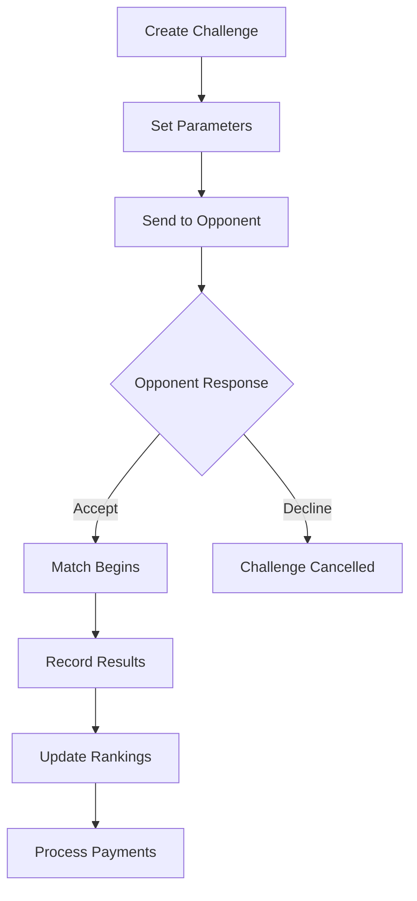

# 🎯 Features Documentation

## Overview

Current feature status and implementation guides for SABO Pool Arena.

## Core Features

### 🔐 Authentication System

**Status**: ✅ Complete

- User registration and login
- Role-based access control (Player/Club Owner/Admin)
- Social authentication integration
- Password reset functionality
- Session management

### 🏆 Tournament System

**Status**: ✅ Complete

- Tournament creation and management
- Bracket generation (single/double elimination)
- Real-time tournament updates
- Prize pool management
- Tournament history and statistics

### ⚔️ Challenge System

**Status**: ✅ Complete

- Player-to-player challenges
- Club vs club challenges
- Betting system integration
- Challenge history tracking
- Real-time notifications

### 🏢 Club Management

**Status**: ✅ Complete

- Club creation and registration
- Member management
- Club tournaments and events
- Club statistics and rankings
- Club vs club competitions

### 💰 Payment Integration

**Status**: ✅ Complete

- VNPAY payment gateway
- Secure transaction processing
- Payment history tracking
- Refund management
- Wallet balance system

### 📊 Ranking System

**Status**: ✅ Complete

- ELO rating system
- Seasonal rankings
- Club rankings
- Tournament performance tracking
- Historical rank progression

### 📱 Real-time Features

**Status**: ✅ Complete

- Live tournament updates
- Real-time notifications
- Challenge status updates
- Social feed updates
- Chat system

### 🛡️ Admin Panel

**Status**: ✅ Complete

- User management
- Tournament oversight
- Payment monitoring
- System analytics
- Content moderation

## Feature Implementation Details

### Tournament Bracket Generation

```typescript
// Bracket generation algorithm
interface BracketGenerator {
  generateSingleElimination(players: Player[]): Bracket;
  generateDoubleElimination(players: Player[]): Bracket;
  generateRoundRobin(players: Player[]): Bracket;
  generateSwiss(players: Player[]): Bracket;
}

// Usage
const bracket = bracketGenerator.generateSingleElimination(tournamentPlayers);
```

### ELO Rating System

```typescript
// ELO calculation
const calculateNewRating = (
  playerRating: number,
  opponentRating: number,
  gameResult: 'win' | 'loss' | 'draw',
  kFactor: number = 32
): number => {
  const expectedScore =
    1 / (1 + Math.pow(10, (opponentRating - playerRating) / 400));
  const actualScore =
    gameResult === 'win' ? 1 : gameResult === 'loss' ? 0 : 0.5;
  return Math.round(playerRating + kFactor * (actualScore - expectedScore));
};
```

### Challenge System Workflow



## API Endpoints

### Authentication

```bash
POST /api/auth/register      # User registration
POST /api/auth/login         # User login
POST /api/auth/logout        # User logout
GET  /api/auth/profile       # Get user profile
PUT  /api/auth/profile       # Update user profile
```

### Tournaments

```bash
GET    /api/tournaments           # List tournaments
POST   /api/tournaments           # Create tournament
GET    /api/tournaments/:id       # Get tournament details
PUT    /api/tournaments/:id       # Update tournament
DELETE /api/tournaments/:id       # Delete tournament
POST   /api/tournaments/:id/join  # Join tournament
```

### Challenges

```bash
GET    /api/challenges           # List challenges
POST   /api/challenges           # Create challenge
GET    /api/challenges/:id       # Get challenge details
PUT    /api/challenges/:id       # Update challenge
POST   /api/challenges/:id/accept # Accept challenge
POST   /api/challenges/:id/decline # Decline challenge
```

### Payments

```bash
POST   /api/payments/create      # Create payment
GET    /api/payments/:id         # Get payment status
POST   /api/payments/verify      # Verify payment
POST   /api/payments/refund      # Process refund
GET    /api/wallet/balance       # Get wallet balance
```

## Database Schema

### Key Tables

```sql
-- Users table
CREATE TABLE users (
  id UUID PRIMARY KEY,
  email VARCHAR UNIQUE NOT NULL,
  username VARCHAR UNIQUE NOT NULL,
  role VARCHAR NOT NULL DEFAULT 'player',
  elo_rating INTEGER DEFAULT 1200,
  created_at TIMESTAMP DEFAULT NOW()
);

-- Tournaments table
CREATE TABLE tournaments (
  id UUID PRIMARY KEY,
  name VARCHAR NOT NULL,
  type VARCHAR NOT NULL,
  max_participants INTEGER,
  entry_fee DECIMAL,
  prize_pool DECIMAL,
  status VARCHAR DEFAULT 'upcoming',
  created_by UUID REFERENCES users(id),
  created_at TIMESTAMP DEFAULT NOW()
);

-- Challenges table
CREATE TABLE challenges (
  id UUID PRIMARY KEY,
  challenger_id UUID REFERENCES users(id),
  challenged_id UUID REFERENCES users(id),
  bet_amount DECIMAL,
  status VARCHAR DEFAULT 'pending',
  winner_id UUID REFERENCES users(id),
  created_at TIMESTAMP DEFAULT NOW()
);
```

## Security Features

### Data Protection

- ✅ Input validation and sanitization
- ✅ SQL injection prevention
- ✅ XSS protection
- ✅ CSRF tokens
- ✅ Rate limiting
- ✅ Secure session management

### Payment Security

- ✅ VNPAY secure integration
- ✅ Transaction encryption
- ✅ PCI DSS compliance
- ✅ Fraud detection
- ✅ Secure webhooks

### Admin Security

- ✅ Role-based access control
- ✅ Admin action logging
- ✅ IP whitelisting
- ✅ Two-factor authentication
- ✅ Regular security audits

## Performance Optimizations

### Frontend Optimizations

- ✅ Code splitting and lazy loading
- ✅ Component memoization
- ✅ Image optimization
- ✅ Bundle size optimization
- ✅ Progressive loading
- ✅ Service worker caching

### Backend Optimizations

- ✅ Database indexing
- ✅ Query optimization
- ✅ Connection pooling
- ✅ Redis caching
- ✅ API rate limiting
- ✅ Background job processing

### Database Optimizations

- ✅ Proper indexing strategy
- ✅ Query performance tuning
- ✅ Connection pooling
- ✅ Read replicas
- ✅ Automated backups
- ✅ Performance monitoring

## Mobile Features

### Responsive Design

- ✅ Mobile-first approach
- ✅ Touch-friendly interface
- ✅ Optimized for small screens
- ✅ Gesture support
- ✅ Fast loading on mobile networks

### PWA Features

- ✅ Offline functionality
- ✅ Push notifications
- ✅ App-like experience
- ✅ Install to home screen
- ✅ Background sync

## Analytics & Monitoring

### User Analytics

- User engagement metrics
- Feature usage tracking
- Conversion funnels
- Retention analysis
- A/B testing framework

### Performance Monitoring

- Real-time performance metrics
- Error tracking and alerting
- Uptime monitoring
- Database performance
- Third-party service monitoring

## Future Enhancements

### Planned Features

- 🔄 Live streaming integration
- 🔄 Advanced statistics dashboard
- 🔄 Social features expansion
- 🔄 Multi-language support
- 🔄 Advanced tournament formats
- 🔄 Sponsorship management
- 🔄 Mobile app development

### Technical Improvements

- 🔄 GraphQL API implementation
- 🔄 Microservices architecture
- 🔄 Advanced caching strategies
- 🔄 Machine learning recommendations
- 🔄 Blockchain integration for transparency

---

_Last Updated: August 5, 2025_
